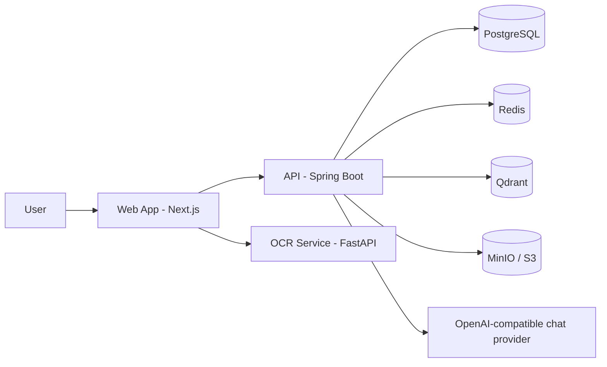

# HealthLens

Intelligent healthcare document processing and health metric explanation platform for Vietnamese users.

## Portfolio Snapshot

HealthLens helps users upload medical documents, extract health metrics with OCR, and receive understandable AI-assisted explanations.  
The project is implemented as a production-oriented monorepo with a web app, API, OCR microservice, and supporting infrastructure.

### Technical Highlights

- Monorepo architecture with `apps` + `services` + shared package.
- End-to-end flow: upload -> OCR extraction -> normalization -> API persistence -> UI visualization.
- Containerized local development using Docker Compose with optimized rebuild workflow.
- CI pipeline for linting, type checks, API tests, and build validation.

## Tech Stack


| Layer                | Technology                                        |
| -------------------- | ------------------------------------------------- |
| Frontend             | Next.js 16, TypeScript, pnpm                      |
| Backend API          | Spring Boot, Java 21, Gradle                      |
| OCR Service          | FastAPI, EasyOCR                                  |
| Data                 | PostgreSQL, Redis, Qdrant                         |
| Object Storage       | MinIO (dev), S3-compatible storage (staging/prod) |
| AI                   | OpenAI-compatible chat provider                  |
| Deployment (staging) | Vercel + Render + Neon + Upstash                  |


## Architecture At A Glance




> Detailed architecture notes: `docs/architecture.md`  
> Staging deployment details: `docs/STAGING_DEPLOYMENT.md`

## Project Structure

```text
health-lens/
├── apps/
│   ├── api/                # Spring Boot API
│   └── web/                # Next.js web app
├── services/
│   └── ocr-service/        # FastAPI OCR service
├── packages/
│   └── shared/             # Shared types/schemas
├── docker/
│   ├── compose.yml
│   ├── compose.dev.yml
│   └── scripts/
├── docs/
└── .env.example
```

## Quick Start (Local)

### Prerequisites

- Docker 24+
- Docker Compose 2.20+

### 1) Setup environment

```bash
cp .env.example .env
```

Update required keys in `.env` (at minimum: `AI_CHAT_*` and Qdrant settings for AI/vector features).

### 2) Start services

```bash
./docker/scripts/up.sh
```

Useful variants:

```bash
./docker/scripts/up.sh --build          # rebuild all images with cache
./docker/scripts/up.sh --no-cache       # force rebuild without cache
./docker/scripts/up.sh --ocr            # include OCR service (extra RAM)
./docker/scripts/up.sh --rebuild-api    # rebuild API image only
./docker/scripts/up.sh --rebuild-web    # rebuild Web image only
./docker/scripts/up.sh --ci             # plain output for CI/non-TTY
```

`up.sh` is optimized for fast local loop: by default it starts containers without rebuilding images.
At the end of each run, it prints build/start/total timing summary.

### 3) Verify local endpoints

- Web: `http://localhost:3000`
- API: `http://localhost:8080`
- MinIO Console: `http://localhost:9001`
- Mailhog (captured dev email): `http://localhost:8025`
- OCR (when enabled): `http://localhost:8001`

### 4) Logs and shutdown

```bash
./docker/scripts/logs.sh api -f
./docker/scripts/logs.sh --menu         # interactive selector
./docker/scripts/logs.sh mailhog --tail 100
./docker/scripts/down.sh
./docker/scripts/down.sh -v        # remove volumes
./docker/scripts/down.sh --clean   # remove compose images + volumes
./docker/scripts/down.sh --clean --yes
./docker/scripts/cleanup.sh --dry-run
```

`logs.sh`, `down.sh`, and `cleanup.sh` also support `--ci` for plain, non-colored output.  
You can also disable ANSI colors via `NO_COLOR=1` (for all Docker scripts).

## Configuration Notes

Use `.env.example` as the source of truth for backend/infrastructure variables. Key examples:

```bash
DB_HOST=postgres
DB_PORT=5432
DB_USERNAME=healthlens
DB_PASSWORD=your_password

API_BASE_URL=http://localhost:8080
OCR_SERVICE_URL=http://localhost:8001
```

For web runtime, the app reads `NEXT_PUBLIC_API_BASE_URL` with a localhost fallback in code.

## Testing

From repository root:

```bash
pnpm test
```

Targeted commands:

```bash
cd apps/api && ./gradlew test
cd apps/web && pnpm test
```

## CI And Branching

Current CI workflow (`.github/workflows/ci.yml`) runs on:

- Push to `main` and `develop` (for app/package/workflow changes)
- Pull requests affecting app/package files

CI covers linting, type checking, API tests, and build jobs.

## Deployment

Current staging reference stack:

- Web: Vercel
- API: Render
- OCR: Render
- Database: Neon
- Redis: Upstash
- Storage: Cloudflare R2

Use `docs/STAGING_DEPLOYMENT.md` for full setup and environment instructions.

## Current Status

Implemented and active:

- Core auth and account flows
- Profile and health record management
- OCR extraction pipeline integration
- Local Docker-based developer workflow
- CI quality checks

Planned / evolving:

- Admin analytics dashboards
- Further documentation and architecture artifacts
