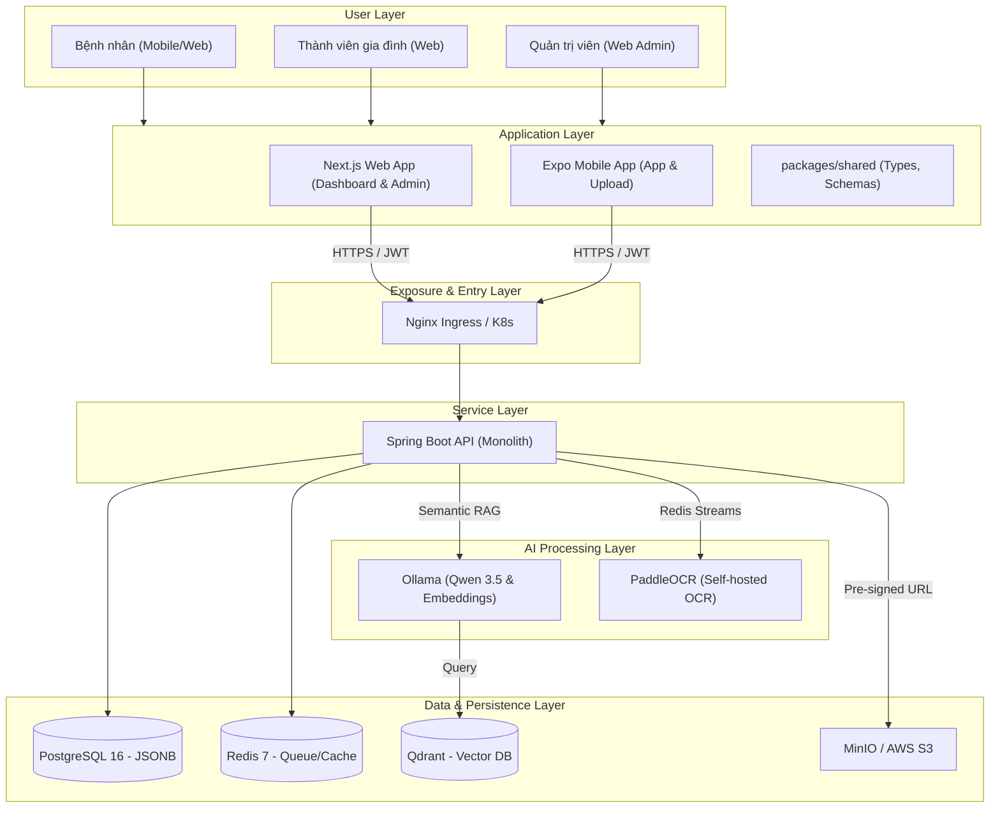
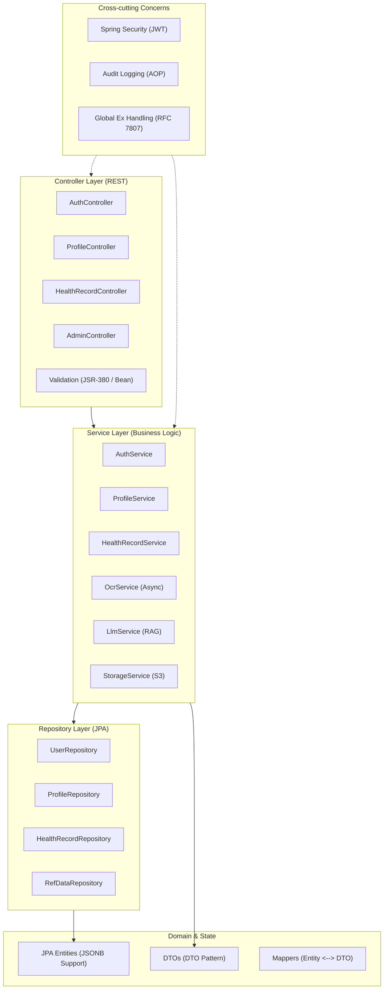
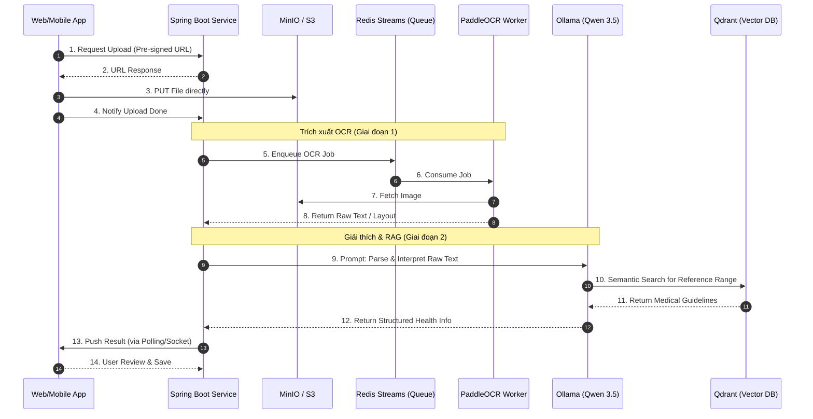
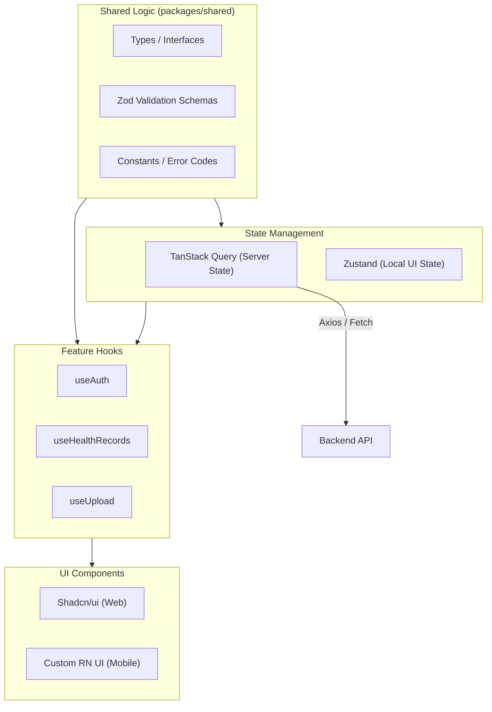
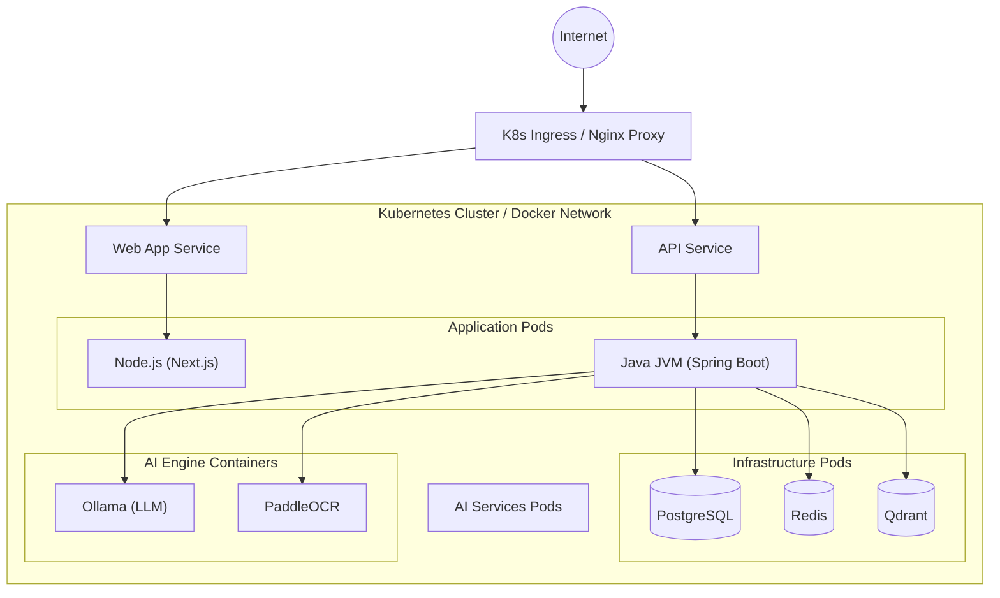
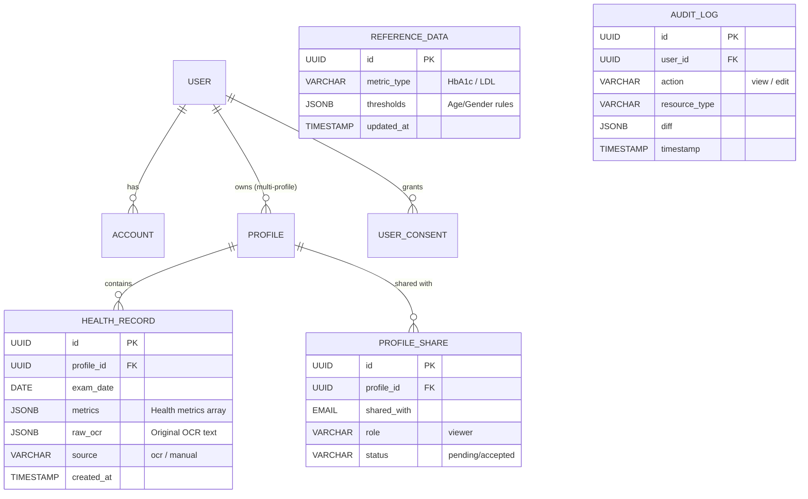

# HealthLens: Exhaustive System Design Documentation

Tài liệu này cung cấp cái nhìn chi tiết và toàn diện về kiến trúc hệ thống HealthLens, được chia thành các góc nhìn (views) kỹ thuật cụ thể.

## 1. Cụm Thành phần Kỹ thuật (C4 Container Diagram)

Mô tả các khối kỹ thuật lớn, ranh giới và cách chúng tương tác qua giao thức mạng.

---

## 2. Kiến trúc Thành phần Backend (Backend Component Architecture)

Chi tiết cấu trúc bên trong ứng dụng Spring Boot theo mô hình **Layered Architecture**.

---

## 3. Luồng Dữ liệu AI Chuyên sâu (AI Data Pipeline Sequence)

Mô tả các bước biến đổi dữ liệu từ file ảnh thô thành thông tin giải thích chuyên sâu.

---

## 4. Kiến trúc Frontend & State Management

Phân rã cách ứng dụng Web (Next.js) và Mobile (Expo) quản lý dữ liệu và chia sẻ logic.

---

## 5. Hạ tầng Triển khai & Mạng (Deployment & Networking)

Mô hình vận hành của hệ thống trong môi trường container hóa.

---

## 6. Mô hình Dữ liệu & Quyền Sở hữu (Data Model & Ownership)

Sơ đồ ERD rút gọn tập trung vào cấu trúc đa hồ sơ và tính bảo mật.

---

## 7. Các Quyết định Kiến trúc Chính (Key Architecture Decisions)

*   **Platform Focus**: Web-First MVP cho Phase 1; Mobile camera/offline deferred sang Phase 2.
*   **AI Philosophy**: Ưu tiên **Self-hosted (Local AI)** qua Ollama và PaddleOCR để tối ưu chi phí ($0 runtime) và bảo vệ dữ liệu y tế nhạy cảm cho người dùng Việt Nam.
*   **Security Model**: TOTP MFA bắt buộc cho Admin Panel; RBAC kết hợp Resource Ownership Checking cho mọi request hồ sơ.
*   **Scale Plan**: Thiết kế Stateless API để sẵn sàng mở rộng ngang (Horizontal Scaling) qua Kubernetes.
