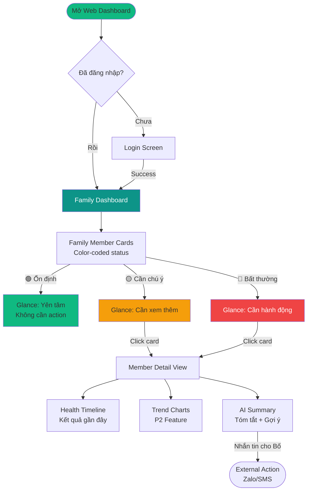

# UX Design Specification — HealthLens

**Author:** ie303
**Date:** 2026-03-17

---

## Executive Summary

### Project Vision

HealthLens là ứng dụng personal health intelligence dành cho người Việt Nam — biến kết quả khám bệnh thô (PDF, ảnh giấy) thành thông tin dễ hiểu và có thể hành động được. 

**Core UX Insight:** Khoảnh khắc người dùng lần đầu *thực sự hiểu* con số trên tờ kết quả khám tạo ra sự gắn kết mạnh mẽ — từ đó họ chủ động quản lý sức khỏe thay vì bị động chờ đợt khám tiếp theo.

**Platforms:**
- Mobile (React Native/Expo) — Primary: upload, chụp camera, xem giải thích
- Web Dashboard (Next.js) — Secondary: gia đình theo dõi read-only, Admin panel

### Target Users

**Primary Persona — Bà Lan (58 tuổi, Hà Nội)**
- Bệnh nhân có mỡ máu cao 3 năm, khám hàng tháng
- Không tech-savvy, chưa từng dùng app sức khỏe
- Nhu cầu: Hiểu chỉ số LDL/HDL/Triglyceride, biết phải làm gì tiếp theo
- Pain point: Nhận kết quả khám nhưng không hiểu, phải nhờ con cháu tra Google

**Secondary Persona — Anh Minh (32 tuổi, TP.HCM)**
- Con trai, bố sống một mình ở Hà Nội, tiểu đường type 2
- Tech-savvy, bận rộn, muốn theo dõi sức khỏe bố từ xa
- Nhu cầu: Dashboard tóm tắt, biết khi nào cần lo lắng
- Pain point: Gọi điện hỏi "bố có ổn không" nhưng không có thông tin cụ thể

**Edge Case Persona — Chị Thu (45 tuổi, Đà Nẵng)**
- Kết quả từ phòng khám tư nhỏ, giấy photocopy mờ
- Cần fallback khi OCR thất bại
- Nhu cầu: Vẫn nhập được dữ liệu dù ảnh không rõ

**Admin Persona**
- Quản trị viên hệ thống
- Nhu cầu: Cập nhật reference data y tế, xem audit logs

### Key Design Challenges

| Challenge | Impact | Chiến lược UX |
|-----------|--------|---------------|
| **Người dùng không tech-savvy** | Cao | UI tối giản, font lớn, ít bước, hướng dẫn rõ ràng |
| **OCR không hoàn hảo** | Cao | Graceful fallback, manual input dễ dàng, không để user bơ vơ |
| **Thông tin y tế nhạy cảm** | Cao | Cân bằng cảnh báo rõ ràng vs. không gây hoảng sợ |
| **Multi-platform consistency** | Trung bình | Design system chung, UX patterns nhất quán |
| **Accessibility (WCAG 2.1 AA)** | Bắt buộc | Font 16px+, icon+text+màu, contrast ratio đủ |

### Design Opportunities

| Opportunity | Competitive Advantage |
|-------------|----------------------|
| **"Aha moment" design** | Tối ưu flow upload → giải thích để tạo khoảnh khắc "hiểu ngay" — retention driver |
| **Visual health explanation** | Icons, biểu đồ đơn giản thay vì chỉ text — phù hợp người cao tuổi |
| **Family trust UX** | UI cho phép con cái "yên tâm" hoặc "lo lắng đúng chỗ" — emotional connection |
| **Progressive disclosure** | Thông tin quan trọng trước, chi tiết khi cần — giảm cognitive load |
| **Offline-first mobile** | UX mượt khi mất mạng — phục vụ users vùng rural VN |

### UX Direction

**Tone of Voice — "Bác sĩ gia đình thân thiện"**
- Thân thiện, ấm áp, không trịch thượng
- Dễ hiểu, không jargon y tế
- Luôn động viên và hướng dẫn hành động cụ thể
- Ví dụ: "LDL là cholesterol 'xấu'. Chỉ số của bạn hơi cao — gợi ý hạn chế đồ chiên rán nhé!"

**Hệ thống cảnh báo 3 mức:**
- 🟢 **Bình thường** — Xanh lá, tone tích cực
- 🟡 **Cần chú ý** — Vàng, nhẹ nhàng + gợi ý cải thiện
- 🔴 **Bất thường** — Đỏ cam, rõ ràng + hướng dẫn gặp bác sĩ

**Visual Direction — "Calm Healthcare"**
- Primary color: Teal (`#0D9488`) — ấm áp, khác biệt với xanh medical lạnh lùng
- Rounded corners (12-16px) — thân thiện
- Generous whitespace — dễ đọc, dễ tap
- Icons đơn giản (Lucide) + illustrations ấm áp có người

---

## Core User Experience

### Defining Experience

**Core Loop:** Upload kết quả khám → Xem giải thích dễ hiểu → Hành động theo gợi ý

Đây là trải nghiệm trung tâm quyết định giá trị sản phẩm. Toàn bộ UX design phải tối ưu cho flow này:
- **Critical path:** Mở app → Chụp ảnh → Chờ 8-10s → Đọc hiểu ngay
- **Success metric:** ≥70% users hoàn thành flow trong lần đầu sử dụng
- **"Aha moment":** Khoảnh khắc user lần đầu thực sự hiểu con số trên kết quả khám

### Platform Strategy

| Platform | Vai trò | Target User | Core Actions |
|----------|---------|-------------|--------------|
| **Mobile (Primary)** | Capture & Consume | Bệnh nhân (Bà Lan) | Chụp camera, upload, xem giải thích, quản lý profiles |
| **Web (Secondary)** | Monitor & Admin | Người thân (Anh Minh), Admin | Dashboard read-only, Admin panel |

**Platform-specific Considerations:**

| Capability | Mobile | Web |
|------------|--------|-----|
| Camera access | ✅ Native | ❌ Không cần |
| Offline mode | ✅ Read-only cache | ❌ Không cần |
| Push notifications | ✅ FCM/APNs | ❌ Không |
| Upload methods | Camera + Gallery + PDF | PDF only |
| Primary interaction | Touch | Mouse/keyboard |

### Effortless Interactions

**Zero-friction Design Goals:**

| Interaction | Target | UX Solution |
|-------------|--------|-------------|
| Chụp ảnh kết quả | 1 tap | Camera với guide frame, auto-focus, auto-crop |
| Xem giải thích | Hiểu trong 5s | Critical info first, progressive disclosure |
| Chuyển profile | 2 taps max | Profile selector always visible |
| Xem lịch sử | Scroll | Vertical timeline, infinite scroll |
| Family dashboard | Glance-able | Color-coded cards, no click needed for status |

**Automatic Behaviors:**
- Auto-detect và correct image orientation
- Auto-suggest profile based on history
- Auto-sync when online (no user action needed)
- Auto-cache recent results for offline viewing

### Critical Success Moments

| Moment | Criticality | UX Goal |
|--------|-------------|---------|
| **First upload success** | 🔴 Critical | Chỉ số trích xuất đúng + giải thích rõ → "App này hay!" |
| **OCR failure recovery** | 🔴 Critical | Clear guidance, không bỏ rơi user |
| **Abnormal reading alert** | 🟡 High | Inform without alarming, actionable advice |
| **Family first view** | 🟡 High | Instant understanding: "Bố ổn" hoặc "Cần gọi hỏi" |
| **Consent flow** | 🟢 Medium | Understand why, không ép buộc |

### User Mental Model

**Cách người dùng hiện tại giải quyết vấn đề:**

| Cách hiện tại | Vấn đề | Cơ hội cho HealthLens |
|---------------|--------|----------------------|
| Tra Google từng chỉ số | Thông tin lộn xộn, đáng sợ, không chính xác | Giải thích chuẩn y khoa, đơn giản |
| Hỏi con cháu | Phiền hà, không phải lúc nào cũng sẵn có | Tự hiểu ngay, không cần ai |
| Đợi tái khám hỏi bác sĩ | Quên mất, lo lắng trong thời gian chờ | Hiểu ngay sau khi nhận kết quả |
| Để đấy không đọc | Bỏ lỡ cảnh báo quan trọng | Thông tin chủ động, dễ tiếp cận |

**Mental Model người dùng mang theo:**
- "App y tế chắc phức tạp lắm" → Cần **onboarding siêu đơn giản**
- "Công nghệ scan chắc không chính xác" → Cần **hiển thị confidence, cho phép sửa**
- "Chỉ số bất thường = nguy hiểm" → Cần **thông điệp calm, hướng dẫn rõ**
- "Con cháu theo dõi = mất quyền riêng tư" → Cần **consent rõ ràng, user kiểm soát**

**Expectation vs Reality:**

| User expects | HealthLens delivers |
|--------------|---------------------|
| Phải nhập tay từng số | Chụp → tự động nhận dạng |
| Chỉ số khô khan | Giải thích dễ hiểu + gợi ý hành động |
| App chỉ lưu trữ | Theo dõi xu hướng theo thời gian |
| Dùng một mình | Chia sẻ với gia đình (nếu muốn) |

### Success Criteria for Core Experience

**"Chụp → Hiểu ngay" Success Criteria:**

| Criteria | Metric | Target |
|----------|--------|--------|
| **Speed** | Time from capture to explanation | ≤10 seconds |
| **Accuracy** | OCR confidence visible to user | ≥85% or fallback triggered |
| **Clarity** | User understands top 3 metrics | ≤5 seconds reading |
| **Completeness** | All critical values extracted | 100% for common tests |
| **Trust** | User believes the interpretation | No medical disclaimers buried |

**Success Indicators — Khi nào user nói "App này hay!":**
1. ✅ Chụp ảnh → thấy kết quả đúng ngay (không cần sửa)
2. ✅ Đọc giải thích → hiểu ngay LDL là gì, mình có ổn không
3. ✅ Thấy gợi ý → biết cần làm gì tiếp theo
4. ✅ Lần sau dùng → flow quen thuộc, nhanh hơn

**Failure Indicators — Khi nào user bỏ app:**
1. ❌ OCR sai nhiều → mất công sửa
2. ❌ Giải thích khó hiểu → không khác gì đọc giấy
3. ❌ Không biết làm gì tiếp → app vô dụng
4. ❌ Quá nhiều bước → phiền phức

### Novel vs Established Patterns

**Pattern Analysis:**

| Aspect | Pattern Type | Rationale |
|--------|--------------|-----------|
| **Navigation** | ✅ Established | Bottom tabs (Zalo, Grab) — VN users quen |
| **Upload flow** | ✅ Established | Camera + Gallery (banking apps) — quen thuộc |
| **OCR feedback** | 🔄 Adapted | Scan overlay từ banking + editable fields |
| **Health explanation** | 🆕 Novel | Plain language + visual status — unique value |
| **Family sharing** | 🔄 Adapted | Consent flow từ healthcare apps + VN context |

**Novel Pattern: "Health Translation"**
- **What's different:** Không chỉ scan, mà "dịch" sang ngôn ngữ dễ hiểu
- **How to teach:** First result có animated highlight "Đây là cách app giải thích"
- **Familiar metaphor:** "Như có bác sĩ giải thích bên cạnh"

**Established Patterns Adopted:**
- Bottom navigation (Home / Upload / Profiles / Settings)
- Card-based content (Apple Health style)
- Pull-to-refresh for sync
- Confirmation before destructive actions

### Experience Mechanics

**Core Flow: "Chụp → Hiểu ngay"**

#### 1. Initiation

| Element | Design |
|---------|--------|
| **Entry point** | FAB "+" button (bottom right) hoặc Tab "Upload" |
| **Invitation** | Empty state: "Chụp ảnh kết quả khám đầu tiên" |
| **Context** | Profile selector visible (ai đang upload cho ai?) |

#### 2. Capture Interaction

| Step | User Action | System Response |
|------|-------------|-----------------|
| Tap "Chụp ảnh" | Open camera | Guide frame overlay "Đặt giấy vào khung" |
| Align document | Position paper | Auto-detect edges, highlight green |
| Tap capture | Take photo | Shutter sound, brief preview |
| Confirm | "Dùng ảnh này" | Show processing state |

#### 3. Processing Feedback

| Duration | UI State | Message |
|----------|----------|---------|
| 0-2s | Spinner | "Đang nhận dạng..." |
| 2-5s | Progress bar | "Đang đọc chỉ số..." |
| 5-8s | Progress bar | "Đang phân tích kết quả..." |
| 8-10s | Checkmark animation | "Hoàn tất!" |

**If OCR fails:**

| Confidence | Action |
|------------|--------|
| ≥85% | Show results, allow edit |
| 50-84% | Show results with "Vui lòng kiểm tra" highlight |
| <50% | "Không đọc được rõ — Chụp lại hoặc Nhập tay?" |

#### 4. Result Display

| Section | Content | Priority |
|---------|---------|----------|
| **Header** | Test type + Date + Profile name | Always visible |
| **Summary** | Overall status (🟢🟡🔴) + 1-line summary | First thing user sees |
| **Key Metrics** | Top 3-5 abnormal/important values | Expanded by default |
| **All Results** | Full list with status indicators | Collapsed, tap to expand |
| **Recommendations** | 2-3 actionable tips | Bottom of card |

#### 5. Completion

| Signal | Design |
|--------|--------|
| **Success feedback** | Subtle confetti + "Đã lưu!" toast |
| **Next action** | "Xem lịch sử" or "Upload thêm" buttons |
| **Undo available** | "Xóa kết quả này" in menu (2 taps) |

### Experience Principles

5 nguyên tắc UX hướng dẫn mọi quyết định thiết kế:

| # | Principle | Meaning | Application |
|---|-----------|---------|-------------|
| **1** | **Clarity over completeness** | Rõ ràng quan trọng hơn đầy đủ | Show top 3 metrics first, rest expandable |
| **2** | **Guide, don't abandon** | Luôn có bước tiếp theo | OCR fail → "Chụp lại" or "Nhập tay" |
| **3** | **Calm confidence** | Tự tin, không lo lắng thừa | Warnings + specific actions, no "dangerous" words |
| **4** | **Respect the context** | Thiết kế cho elderly, poor lighting, rush | Large fonts/buttons, high contrast, minimal steps |
| **5** | **Trust through transparency** | Giải thích nguồn gốc & giới hạn | Tag "OCR detected" vs "Manual input" |

---

## Desired Emotional Response

### Primary Emotional Goals

| Emotion | Mô tả | Tại sao quan trọng |
|---------|-------|-------------------|
| **Được hiểu (Understood)** | "Cuối cùng có ai giải thích cho tôi" | Core value — biến jargon y tế thành tiếng Việt dễ hiểu |
| **Tự tin (Confident)** | "Tôi biết mình cần làm gì" | Empowerment — chủ động quản lý sức khỏe |
| **An tâm (Reassured)** | "Mọi thứ đang được theo dõi" | Trust — cả bệnh nhân và gia đình yên tâm |

### Emotional Journey Mapping

| Giai đoạn | Current Feeling | Target Emotion | UX Approach |
|-----------|-----------------|----------------|-------------|
| **Onboarding** | Tò mò, hơi lo | Chào đón, dễ dàng | Ngôn ngữ thân thiện, ít bước |
| **First upload** | Hồi hộp | Tin tưởng, ấn tượng | Loading rõ ràng, celebration khi thành công |
| **Đọc giải thích** | Muốn hiểu nhanh | "Aha!", empowered | Thông tin quan trọng trước |
| **Thấy cảnh báo** | Lo lắng | Calm concern, guided | Giải thích + hành động cụ thể |
| **OCR thất bại** | Thất vọng | Được hỗ trợ | "Không sao, thử cách khác" |
| **Quay lại dùng** | Quen thuộc | Efficient, in control | Fast access, remember preferences |
| **Family dashboard** | Lo về người thân | Yên tâm hoặc biết cần hành động | Instant visual summary |

### Micro-Emotions

**Emotions to Create:**
- ✅ **Tin tưởng** — App biết việc, data an toàn
- ✅ **Tự tin** — Tôi hiểu sức khỏe của mình
- ✅ **Kết nối** — Gia đình cùng quan tâm
- ✅ **Nhẹ nhõm** — Cuối cùng cũng hiểu
- ✅ **Thành thạo** — Dùng app dễ dàng

**Emotions to Avoid:**
- ❌ **Hoang mang** — Không hiểu phải làm gì
- ❌ **Hoảng sợ** — Chỉ số bất thường = nguy hiểm
- ❌ **Bị theo dõi** — Mất quyền riêng tư
- ❌ **Bị đổ lỗi** — "Ảnh bạn chụp tệ quá"
- ❌ **Bất lực** — Công nghệ quá khó

### Design Implications

| Emotion Goal | UX Design Approach |
|--------------|-------------------|
| **Được hiểu** | Ngôn ngữ đơn giản, ví dụ cụ thể, analogies quen thuộc |
| **Tự tin** | Clear next steps, actionable recommendations |
| **An tâm** | Confirmation messages, progress indicators, sync status |
| **Trust** | Transparent data sourcing, privacy controls visible |
| **Calm concern** | Warning with guidance, không từ "nguy hiểm" |
| **Not blamed** | Error messages focus on solution |
| **Connected** | Family features = "caring together" không phải "monitoring" |

### Emotional Design Principles

| # | Principle | Application |
|---|-----------|-------------|
| **E1** | **Celebrate small wins** | "Tuyệt vời! Đã lưu kết quả" + micro-animation |
| **E2** | **Warm over clinical** | "Chỉ số ổn định, tiếp tục duy trì nhé!" |
| **E3** | **Action over anxiety** | Cảnh báo + hướng dẫn cụ thể |
| **E4** | **Supportive failures** | "Ảnh hơi mờ — thử chụp lại hoặc nhập tay nhé!" |
| **E5** | **Family = caring, not watching** | "Anh Minh muốn cùng theo dõi sức khỏe với bạn" |


---

## UX Pattern Analysis & Inspiration

### Inspiring Products Analysis

#### 1. Zalo — Benchmark cho VN elderly users
- **Relevance:** 70%+ người VN dùng, bao gồm người cao tuổi
- **Key patterns:** Bottom navigation, large fonts, simple flows
- **Lesson:** Simplicity wins với VN users

#### 2. Apple Health — Health data display chuẩn mực
- **Relevance:** Best-in-class health metrics visualization
- **Key patterns:** Card-based UI, color-coded status, progressive disclosure
- **Lesson:** Summary first, details on demand

#### 3. Duolingo — Emotional design cho non-tech users
- **Relevance:** Onboarding xuất sắc, mọi lứa tuổi dùng được
- **Key patterns:** Celebrate wins, supportive failures, friendly tone
- **Lesson:** Positive emotions drive engagement

#### 4. MyFitnessPal — Graceful degradation
- **Relevance:** Scan + manual input hybrid (similar to OCR + fallback)
- **Key patterns:** Always alternative path, quick-add options
- **Lesson:** Never dead-end users

#### 5. Grab — VN-localized super app UX
- **Relevance:** VN users mọi lứa tuổi quen dùng
- **Key patterns:** Large CTAs, confirmation screens, natural Vietnamese
- **Lesson:** Localization beyond translation

### Transferable UX Patterns

**Navigation:**
- Bottom tab navigation (Home, Upload, Profiles, Settings)
- Card-based content organization
- Pull-to-refresh for sync

**Interaction:**
- Scan + manual fallback always visible
- Tap to expand for details
- Confirmation before destructive actions

**Visual:**
- Color-coded status (🟢🟡🔴)
- Large typography (16px min, 18-20px for health data)
- Generous spacing (16-24px padding)

**Emotional:**
- Supportive failure messages
- Celebration micro-interactions
- Trust through transparency

### Anti-Patterns to Avoid

| Avoid | Replace with |
|-------|--------------|
| Hamburger menu only | Visible bottom tabs |
| Small touch targets | Min 48px buttons |
| Medical jargon | Plain Vietnamese + explanation |
| "Danger" messaging | "Cần chú ý" + action guidance |
| Complex onboarding | Minimal steps |
| Blame-based errors | Solution-focused messages |

### Design Inspiration Strategy

**Adopt:** Bottom tabs, card-based display, color-coded status, large touch targets

**Adapt:** 
- Duolingo celebrations → Warm/reassuring (not playful)
- Apple Health charts → Simplified for MVP
- MyFitnessPal input → Guided step-by-step

**Avoid:** Gamification, social features, complex gestures, dark patterns

---

## Design System Foundation

### Design System Strategy

**Quyết định:** Shadcn/ui (Web) + Custom React Native Components (Mobile) + Shared Design Tokens

**Lý do:**
- Shadcn/ui built on Radix UI (đã chọn trong Architecture) + Tailwind CSS
- Copy-paste approach = full control, no library lock-in
- Accessible by default (WCAG 2.1 AA compliant)
- React Native cần custom components nhưng share tokens với web

### Design Token Architecture

```
packages/shared/design-tokens/
├── colors.ts          # Semantic color tokens
├── typography.ts      # Font sizes, weights, line heights
├── spacing.ts         # Consistent spacing scale
├── radii.ts           # Border radius tokens
├── shadows.ts         # Elevation system
└── index.ts           # Unified export
```

### Core Tokens

#### Colors (Semantic)

| Token | Value | Usage |
|-------|-------|-------|
| `--primary` | `#0D9488` (Teal 600) | Primary actions, links |
| `--primary-foreground` | `#FFFFFF` | Text on primary |
| `--secondary` | `#F1F5F9` (Slate 100) | Secondary buttons, backgrounds |
| `--destructive` | `#EF4444` (Red 500) | Errors, delete actions |
| `--warning` | `#F59E0B` (Amber 500) | Warnings, "cần chú ý" |
| `--success` | `#10B981` (Emerald 500) | Success states, "bình thường" |
| `--muted` | `#64748B` (Slate 500) | Muted text |
| `--background` | `#FFFFFF` | Page backgrounds |
| `--card` | `#FFFFFF` | Card backgrounds |
| `--border` | `#E2E8F0` (Slate 200) | Borders |

#### Health Status Colors

| Status | Background | Text | Icon |
|--------|------------|------|------|
| 🟢 Bình thường | `#ECFDF5` | `#065F46` | `#10B981` |
| 🟡 Cần chú ý | `#FFFBEB` | `#92400E` | `#F59E0B` |
| 🔴 Bất thường | `#FEF2F2` | `#991B1B` | `#EF4444` |

#### Typography Scale

| Token | Mobile | Web | Usage |
|-------|--------|-----|-------|
| `--text-xs` | 12px | 12px | Captions |
| `--text-sm` | 14px | 14px | Secondary text |
| `--text-base` | 16px | 16px | Body text (minimum) |
| `--text-lg` | 18px | 18px | Emphasized text |
| `--text-xl` | 20px | 20px | Health metrics |
| `--text-2xl` | 24px | 24px | Section headers |
| `--text-3xl` | 30px | 30px | Page titles |

**Font Family:**
- Vietnamese-optimized: `'Inter', 'Roboto', system-ui, sans-serif`
- Line height: 1.5 (body), 1.2 (headings)

#### Spacing Scale

| Token | Value | Usage |
|-------|-------|-------|
| `--space-1` | 4px | Tight spacing |
| `--space-2` | 8px | Icon gaps |
| `--space-3` | 12px | Small padding |
| `--space-4` | 16px | Standard padding |
| `--space-5` | 20px | Medium spacing |
| `--space-6` | 24px | Section spacing |
| `--space-8` | 32px | Large spacing |
| `--space-10` | 40px | Extra large |

#### Border Radius

| Token | Value | Usage |
|-------|-------|-------|
| `--radius-sm` | 4px | Small elements |
| `--radius-md` | 8px | Buttons, inputs |
| `--radius-lg` | 12px | Cards |
| `--radius-xl` | 16px | Modals, large cards |
| `--radius-full` | 9999px | Pills, avatars |

### Component Library Plan

#### Web (Shadcn/ui Components)

**Phase 1 - MVP Core:**
- Button (primary, secondary, ghost, destructive)
- Card (health result display)
- Input (text, file upload)
- Select (profile picker)
- Dialog (confirmations)
- Alert (health status notifications)
- Tabs (navigation within pages)
- Skeleton (loading states)

**Phase 2 - Enhanced:**
- Toast (feedback messages)
- Dropdown Menu (actions)
- Avatar (profile pictures)
- Badge (status indicators)
- Progress (upload/processing)

#### Mobile (Custom RN Components)

**Phase 1 - MVP Core:**
- Button (variants matching web)
- Card (health results)
- TextInput (forms)
- Picker (profile selection)
- Modal (confirmations)
- Alert (custom, not native)
- TabBar (bottom navigation)
- ActivityIndicator (loading)

**Phase 2 - Enhanced:**
- Toast (react-native-toast-message)
- ActionSheet (iOS-style menus)
- Avatar (with fallback)
- Badge (notification dots)
- ProgressBar (upload)

### Accessibility Requirements

| Requirement | Implementation |
|-------------|----------------|
| Color contrast | 4.5:1 minimum (AA) |
| Touch targets | 48x48px minimum |
| Focus indicators | 2px outline, visible |
| Screen reader | Proper ARIA labels |
| Font scaling | Support 200% scaling |
| Reduced motion | Respect prefers-reduced-motion |

### Implementation Notes

**Web (apps/web):**
```bash
npx shadcn-ui@latest init
npx shadcn-ui@latest add button card input ...
```
Components go to `apps/web/src/components/ui/`

**Mobile (apps/mobile):**
Custom components in `apps/mobile/src/components/ui/`
Import tokens from `@health-lens/design-tokens`

**Shared Tokens:**
```typescript
// packages/shared/design-tokens/colors.ts
export const colors = {
  primary: '#0D9488',
  // ... rest of tokens
}
```

---

## Visual Design Foundation

### Visual Strategy Summary

**Design Philosophy: "Calm Healthcare"**

| Principle | Implementation |
|-----------|----------------|
| **Warmth over clinical** | Teal primary thay vì xanh medical lạnh |
| **Spacious over dense** | Generous whitespace, không chen chúc |
| **Friendly over formal** | Rounded corners, soft shadows |
| **Clear over decorative** | Functional icons, minimal ornamentation |

### Layout Foundation

**Grid System:**

| Platform | Grid | Columns | Gutter | Margin |
|----------|------|---------|--------|--------|
| Mobile | Fluid | 4 | 16px | 16px |
| Tablet | Fluid | 8 | 24px | 24px |
| Desktop | Fixed (1280px max) | 12 | 24px | Auto |

**Content Density:**
- **Mobile:** Single column, stacked cards, generous touch targets
- **Tablet:** 2-column grid for dashboard, single column for detail views
- **Desktop:** 3-column max, sidebar navigation, central content area

**Layout Patterns:**

| Pattern | Usage | Spacing |
|---------|-------|---------|
| **Stack** | Forms, lists, result details | 16px gap |
| **Card Grid** | Dashboard, history view | 16px gap |
| **Split View** | Tablet dashboard (list + detail) | 24px divider |
| **Full Bleed** | Camera view, onboarding | Edge-to-edge |

### Visual Hierarchy

**Z-Index System:**

| Layer | Z-Index | Elements |
|-------|---------|----------|
| Base | 0 | Page content |
| Sticky | 10 | Bottom tabs, headers |
| Dropdown | 20 | Menus, pickers |
| Modal | 30 | Dialogs, confirmations |
| Toast | 40 | Notifications |
| Overlay | 50 | Loading states |

**Elevation System (Shadows):**

| Level | Shadow | Usage |
|-------|--------|-------|
| `--shadow-sm` | `0 1px 2px rgba(0,0,0,0.05)` | Cards at rest |
| `--shadow-md` | `0 4px 6px rgba(0,0,0,0.1)` | Cards on hover, buttons |
| `--shadow-lg` | `0 10px 15px rgba(0,0,0,0.1)` | Modals, dropdowns |
| `--shadow-xl` | `0 20px 25px rgba(0,0,0,0.15)` | Floating action button |

### Iconography

**Icon Library:** Lucide Icons (MIT license, consistent style)

**Icon Sizing:**

| Size | Pixels | Usage |
|------|--------|-------|
| `--icon-sm` | 16px | Inline with text |
| `--icon-md` | 20px | Buttons, list items |
| `--icon-lg` | 24px | Navigation, headers |
| `--icon-xl` | 32px | Empty states, features |

**Custom Icons Needed:**
- Health status indicators (heart, checkmark, warning)
- Test type icons (blood, urine, imaging)
- Profile avatars (user, family member)

### Animation & Motion

**Motion Principles:**
- **Purposeful:** Animation phải có ý nghĩa, không trang trí
- **Swift:** Duration ngắn (150-300ms) để không gây khó chịu
- **Natural:** Easing curves tự nhiên

**Animation Tokens:**

| Token | Duration | Easing | Usage |
|-------|----------|--------|-------|
| `--duration-fast` | 150ms | ease-out | Hover states, toggles |
| `--duration-normal` | 200ms | ease-in-out | Page transitions |
| `--duration-slow` | 300ms | ease-in-out | Modals, complex animations |

**Key Animations:**
- **Success celebration:** Subtle confetti (300ms) khi upload thành công
- **Processing:** Pulsing progress bar với text thay đổi
- **Card expand:** Smooth height transition (200ms)
- **Toast:** Slide in from bottom (200ms), auto-dismiss (3s)

**Reduced Motion:**
```css
@media (prefers-reduced-motion: reduce) {
  * { animation-duration: 0.01ms !important; }
}
```

### Responsive Breakpoints

| Breakpoint | Width | Target |
|------------|-------|--------|
| `--screen-sm` | 640px | Large phones |
| `--screen-md` | 768px | Tablets portrait |
| `--screen-lg` | 1024px | Tablets landscape, small laptops |
| `--screen-xl` | 1280px | Desktop |
| `--screen-2xl` | 1536px | Large desktop |

**Mobile-first approach:** Base styles for mobile, progressive enhancement for larger screens.

---

## Design Direction Decision

### Design Directions Explored

#### Direction A: "Minimal Calm" (Recommended)

**Philosophy:** Tối giản tối đa, whitespace làm chủ đạo

| Aspect | Approach |
|--------|----------|
| **Layout** | Single-column focus, card stacking |
| **Density** | Very spacious (24-32px gaps) |
| **Visual weight** | Light, airy |
| **Navigation** | Bottom tabs, minimal icons |
| **Cards** | Large, rounded (16px), subtle shadow |
| **Typography** | Bold headings, generous line-height |

**Best for:** Elderly users (Bà Lan), first-time app users
**Trade-off:** Less information density, more scrolling

#### Direction B: "Structured Dashboard"

**Philosophy:** Information-rich, organized grid

| Aspect | Approach |
|--------|----------|
| **Layout** | 2-column grid on tablet/desktop |
| **Density** | Medium (16px gaps) |
| **Visual weight** | Medium, structured |
| **Navigation** | Bottom tabs + contextual headers |
| **Cards** | Compact, sharp corners (8px) |
| **Typography** | Regular weight, efficient spacing |

**Best for:** Family dashboard (Anh Minh), power users
**Trade-off:** May overwhelm elderly users

#### Direction C: "Warm Illustrated"

**Philosophy:** Illustrations & warmth reduce medical anxiety

| Aspect | Approach |
|--------|----------|
| **Layout** | Single-column with illustrations |
| **Density** | Medium-spacious |
| **Visual weight** | Medium with visual interest |
| **Navigation** | Bottom tabs with custom icons |
| **Cards** | With small illustrations, rounded |
| **Typography** | Friendly, slightly playful |

**Best for:** Emotional engagement, onboarding
**Trade-off:** Requires illustration assets, may feel less "professional"

#### Direction D: "Progressive Disclosure"

**Philosophy:** Summary first, details on demand

| Aspect | Approach |
|--------|----------|
| **Layout** | Expandable/collapsible sections |
| **Density** | Variable (compact summary, spacious detail) |
| **Visual weight** | Light summary, rich detail |
| **Navigation** | Bottom tabs + floating action button |
| **Cards** | Expandable with smooth animation |
| **Typography** | Hierarchical (summary bold, detail regular) |

**Best for:** Balancing simplicity and depth
**Trade-off:** More complex interaction patterns

### Chosen Direction

**"Minimal Calm with Progressive Disclosure" (A + D Hybrid)**

| Element | Decision | Source |
|---------|----------|--------|
| **Overall feel** | Minimal, calm, spacious | Direction A |
| **Information display** | Summary first, expandable | Direction D |
| **Card design** | Large, rounded (16px), subtle shadow | Direction A |
| **Touch targets** | 48px minimum, generous spacing | Direction A |
| **Navigation** | Bottom tabs (4 items) | Shared |
| **FAB** | "+" button for upload | Direction D |
| **Animations** | Subtle, purposeful | Direction D |

### Design Rationale

1. **Primary user (Bà Lan)** cần giao diện đơn giản, rõ ràng → Direction A
2. **Core experience (xem kết quả)** cần cân bằng overview vs detail → Direction D
3. **Emotional goal (Calm)** phù hợp với minimal approach
4. **Accessibility** được đảm bảo với spacious layout

### Key Screen Layouts

#### Home Screen (Mobile)

```
┌─────────────────────────────┐
│ HealthLens        [Profile] │ Header
├─────────────────────────────┤
│                             │
│  ┌─────────────────────┐    │
│  │ 👤 Bà Lan           │    │ Profile Card
│  │ Cập nhật: Hôm nay   │    │
│  │ 🟢 Sức khỏe ổn định │    │
│  └─────────────────────┘    │
│                             │
│  Kết quả gần đây            │ Section Header
│                             │
│  ┌─────────────────────┐    │
│  │ 📋 Xét nghiệm máu   │    │ Result Card
│  │ 15/03/2026          │    │ (Tappable)
│  │ 🟡 2 chỉ số cần chú ý│    │
│  │           [Xem] →   │    │
│  └─────────────────────┘    │
│                             │
│  ┌─────────────────────┐    │
│  │ 📋 Đường huyết      │    │
│  │ 10/03/2026          │    │
│  │ 🟢 Bình thường      │    │
│  └─────────────────────┘    │
│                             │
│              [+]            │ FAB
├─────────────────────────────┤
│ 🏠    📤    👥    ⚙️       │ Bottom Tabs
│ Home Upload Profiles Settings│
└─────────────────────────────┘
```

#### Result Detail Screen (Mobile)

```
┌─────────────────────────────┐
│ ← Xét nghiệm máu   [Share]  │ Header
├─────────────────────────────┤
│                             │
│  Bà Lan • 15/03/2026        │ Context
│                             │
│  ┌─────────────────────┐    │
│  │ 🟡 TỔNG QUAN        │    │ Summary Card
│  │                     │    │ (Always visible)
│  │ 2 chỉ số cần chú ý  │    │
│  │ 8 chỉ số bình thường│    │
│  └─────────────────────┘    │
│                             │
│  Cần chú ý                  │ Section
│                             │
│  ┌─────────────────────┐    │
│  │ LDL Cholesterol     │    │ Metric Card
│  │ 145 mg/dL  🟡       │    │ (Expandable)
│  │ Cao hơn bình thường │    │
│  │ [Xem giải thích ▼]  │    │
│  └─────────────────────┘    │
│                             │
│  ┌ ─ ─ ─ ─ ─ ─ ─ ─ ─ ─ ┐    │
│  │ Expanded:           │    │ Expanded State
│  │ LDL là cholesterol  │    │
│  │ "xấu". Chỉ số này   │    │
│  │ hơi cao.            │    │
│  │                     │    │
│  │ 💡 Gợi ý: Hạn chế   │    │
│  │ đồ chiên, ăn nhiều  │    │
│  │ rau xanh.           │    │
│  └ ─ ─ ─ ─ ─ ─ ─ ─ ─ ─ ┘    │
│                             │
│  Bình thường                │ Section
│  [Xem 8 chỉ số ▼]           │ (Collapsed)
│                             │
└─────────────────────────────┘
```

#### Family Dashboard (Web)

```
┌──────────────────────────────────────────────────────────────┐
│ HealthLens                              [Anh Minh ▼] [Logout]│
├──────────────────────────────────────────────────────────────┤
│                                                              │
│  Theo dõi sức khỏe gia đình                                  │
│                                                              │
│  ┌──────────────────┐  ┌──────────────────┐                  │
│  │ 👤 Bố (Ông Hùng) │  │ 👤 Mẹ (Bà Mai)  │                  │
│  │                  │  │                  │                  │
│  │ 🟡 Cần chú ý     │  │ 🟢 Ổn định      │                  │
│  │                  │  │                  │                  │
│  │ Đường huyết cao  │  │ Mọi chỉ số      │                  │
│  │ hơn bình thường  │  │ bình thường     │                  │
│  │                  │  │                  │                  │
│  │ Cập nhật: 2 ngày │  │ Cập nhật: 1 tuần│                  │
│  │                  │  │                  │                  │
│  │ [Xem chi tiết →] │  │ [Xem chi tiết →]│                  │
│  └──────────────────┘  └──────────────────┘                  │
│                                                              │
│  Hoạt động gần đây                                           │
│  ─────────────────────────────────────────────────────────── │
│  • Bố upload kết quả mới (2 ngày trước)                      │
│  • Mẹ upload kết quả mới (1 tuần trước)                      │
│                                                              │
└──────────────────────────────────────────────────────────────┘
```

### Implementation Approach

| Phase | Focus | Components |
|-------|-------|------------|
| **Phase 1** | Core mobile experience | Home, Upload, Result Detail |
| **Phase 2** | Profile management | Profile list, Profile detail, Add profile |
| **Phase 3** | Family web dashboard | Dashboard, Shared view |
| **Phase 4** | Polish & edge cases | OCR fallback, Settings, Onboarding |

---

## User Journey Flows

### Journey 1: Upload & Understand (Bà Lan — Primary Happy Path)

**Goal:** Chụp ảnh kết quả khám → Hiểu chỉ số trong 30 giây

```mermaid
flowchart TD
    START([Mở App]) --> HOME[Home Screen]
    HOME --> |Tap FAB "+"| UPLOAD_CHOICE{Chọn nguồn}
    
    UPLOAD_CHOICE --> |Camera| CAMERA[Camera Screen]
    UPLOAD_CHOICE --> |Thư viện| GALLERY[Image Picker]
    UPLOAD_CHOICE --> |PDF| PDF_PICKER[Document Picker]
    
    CAMERA --> |Chụp| PREVIEW[Preview Image]
    GALLERY --> PREVIEW
    PDF_PICKER --> PREVIEW
    
    PREVIEW --> |"Dùng ảnh này"| PROFILE_SELECT[Chọn hồ sơ]
    PREVIEW --> |"Chụp lại"| CAMERA
    
    PROFILE_SELECT --> PROCESSING[Processing Screen<br/>8-10 giây]
    
    PROCESSING --> OCR_CHECK{OCR Success?}
    
    OCR_CHECK --> |≥85% confidence| RESULT[Result Screen<br/>Danh sách chỉ số]
    OCR_CHECK --> |50-84%| RESULT_WARN[Result + Warning<br/>"Vui lòng kiểm tra"]
    OCR_CHECK --> |<50%| OCR_FAIL[OCR Failed Screen]
    
    RESULT --> |Tap chỉ số| DETAIL[Chi tiết + Giải thích<br/>LLM Explanation]
    RESULT_WARN --> |Review & Confirm| RESULT
    
    OCR_FAIL --> |"Chụp lại"| CAMERA
    OCR_FAIL --> |"Nhập tay"| MANUAL[Manual Input Form]
    MANUAL --> RESULT
    
    DETAIL --> |Xong| SUCCESS([Đã lưu ✓<br/>Toast notification])
    
    style START fill:#10B981
    style SUCCESS fill:#10B981
    style OCR_FAIL fill:#F59E0B
    style RESULT fill:#0D9488,color:#fff
    style DETAIL fill:#0D9488,color:#fff
```

**Key UX Decisions:**

| Step | UX Decision | Rationale |
|------|-------------|-----------|
| FAB "+" | Luôn visible ở bottom-right | Entry point rõ ràng |
| Profile select | Sau khi chọn ảnh, trước processing | Tránh upload nhầm profile |
| Processing | Progress bar + text thay đổi | Giảm perceived wait time |
| OCR fail | 2 options rõ ràng | Không dead-end user |
| Result | Summary first, tap to expand | Progressive disclosure |

---

### Journey 2: Family Monitoring (Anh Minh — Web Dashboard)

**Goal:** Glance-able dashboard — biết tình trạng gia đình trong 10 giây



**Key UX Decisions:**

| Step | UX Decision | Rationale |
|------|-------------|-----------|
| Dashboard | Cards grid layout | Scan multiple members quickly |
| Color coding | 🟢🟡🔴 visible at glance | Instant status recognition |
| Click depth | 1 click to details | Efficient for busy users |
| AI summary | Actionable language | "Nhắc ông..." not just "HbA1c cao" |

---

### Journey 3: OCR Failure Recovery (Chị Thu — Edge Case)

**Goal:** Graceful degradation — vẫn lưu được dữ liệu dù OCR fail

```mermaid
flowchart TD
    START([Upload ảnh mờ]) --> PROCESSING[Processing<br/>12+ giây]
    
    PROCESSING --> PARTIAL{Kết quả OCR}
    
    PARTIAL --> |3/8 chỉ số| PARTIAL_RESULT[Partial Result Screen]
    
    PARTIAL_RESULT --> OPTIONS{User chọn}
    
    OPTIONS --> |"Chụp lại rõ hơn"| CAMERA[Camera với tips<br/>"Đặt giấy phẳng,<br/>ánh sáng đều"]
    OPTIONS --> |"Nhập thủ công"| MANUAL[Manual Input Form]
    OPTIONS --> |"Giữ những gì có"| SAVE_PARTIAL[Save 3 chỉ số]
    
    CAMERA --> PROCESSING
    
    MANUAL --> FORM[Form từng chỉ số<br/>Dropdown + Number input]
    FORM --> |Xong| MERGE[Merge: OCR + Manual]
    
    MERGE --> COMPLETE[Complete Result<br/>8/8 chỉ số]
    SAVE_PARTIAL --> INCOMPLETE[Incomplete Result<br/>3/8 chỉ số + tag]
    
    COMPLETE --> TAG[Ghi chú nguồn<br/>"5 OCR, 3 thủ công"]
    INCOMPLETE --> TAG
    
    TAG --> SUCCESS([Đã lưu ✓])
    
    style START fill:#F59E0B
    style SUCCESS fill:#10B981
    style PARTIAL_RESULT fill:#F59E0B
    style COMPLETE fill:#0D9488,color:#fff
```

**Key UX Decisions:**

| Step | UX Decision | Rationale |
|------|-------------|-----------|
| Partial result | Show what we got | Don't hide partial success |
| 3 options | Clear paths forward | User controls recovery |
| Camera tips | Contextual guidance | Help them succeed |
| Source tagging | Transparent | Trust through honesty |
| Save partial | Always possible | Never lose user's effort |

---

### Journey 4: Admin Reference Data (Admin Panel)

**Goal:** Safe, auditable reference data updates

```mermaid
flowchart TD
    START([Admin Login]) --> MFA[MFA Verification]
    MFA --> DASHBOARD[Admin Dashboard]
    
    DASHBOARD --> REF_DATA[Reference Data Management]
    
    REF_DATA --> SEARCH[Search: "HbA1c"]
    SEARCH --> VIEW[View Current Values<br/>Ngưỡng hiện tại]
    
    VIEW --> EDIT[Edit Mode]
    EDIT --> FORM[Update Form<br/>- Giá trị mới<br/>- Nguồn tham chiếu<br/>- Ghi chú]
    
    FORM --> PREVIEW[Preview Changes<br/>Before vs After]
    PREVIEW --> CONFIRM{Xác nhận?}
    
    CONFIRM --> |Cancel| VIEW
    CONFIRM --> |Save| AUDIT[Audit Log Entry<br/>Who, When, What]
    
    AUDIT --> APPLY{Apply scope}
    APPLY --> |Kết quả mới| NEW_RESULTS[Apply cho kết quả mới]
    APPLY --> |Kết quả cũ| KEEP_OLD[Giữ annotation gốc]
    
    NEW_RESULTS --> SUCCESS([Update Complete ✓])
    
    style START fill:#10B981
    style SUCCESS fill:#10B981
    style MFA fill:#F59E0B
    style AUDIT fill:#0D9488,color:#fff
```

**Key UX Decisions:**

| Step | UX Decision | Rationale |
|------|-------------|-----------|
| MFA | Required for admin | Security critical |
| Preview | Before/After comparison | Prevent mistakes |
| Audit log | Automatic | Compliance + debugging |
| Apply scope | Explicit choice | Old results keep context |

---

### Journey Patterns

**Navigation Patterns:**

| Pattern | Usage | Implementation |
|---------|-------|----------------|
| **Bottom Tabs** | Primary navigation (mobile) | Home, Upload, Profiles, Settings |
| **Back + Title** | Detail screens | ← Xét nghiệm máu |
| **FAB** | Primary action | "+" for upload |
| **Breadcrumb** | Admin panel | Reference Data > HbA1c |

**Feedback Patterns:**

| Pattern | Usage | Implementation |
|---------|-------|----------------|
| **Progress Bar** | Long operations (>3s) | OCR processing |
| **Toast** | Success confirmations | "Đã lưu!" (3s auto-dismiss) |
| **Inline Warning** | Partial success | Yellow highlight + text |
| **Modal** | Destructive confirmations | "Xóa kết quả này?" |

**Error Recovery Patterns:**

| Pattern | Usage | Implementation |
|---------|-------|----------------|
| **Retry + Alternative** | OCR fail | "Chụp lại" + "Nhập tay" |
| **Partial Save** | Incomplete data | Save what we have + tag |
| **Contextual Help** | Camera tips | Inline guidance |
| **Undo** | Accidental actions | "Hoàn tác" trong toast |

### Flow Optimization Principles

| Principle | Application |
|-----------|-------------|
| **Minimize taps to value** | Upload → Result trong 3 taps |
| **Show progress, not spinners** | Text updates during processing |
| **Never dead-end** | Always 2+ options on failure |
| **Celebrate success** | Subtle animation + positive message |
| **Tag uncertainty** | "OCR detected" vs "Manual input" |
| **Glance-able status** | Color + icon + text (accessibility) |

---

## Component Strategy

### Design System Components (Available)

**Từ Shadcn/ui (Web):**

| Component | Usage trong HealthLens |
|-----------|----------------------|
| Button | CTAs, actions, navigation |
| Card | Health result cards, profile cards |
| Input | Forms, search |
| Select | Profile picker, dropdown filters |
| Dialog | Confirmations, consent modals |
| Alert | Inline notifications |
| Tabs | Tab navigation |
| Skeleton | Loading states |
| Toast | Success/error feedback |
| Progress | Upload/processing progress |
| Avatar | Profile pictures |
| Badge | Status indicators |

**Từ React Native (Mobile) — cần custom:**
Các components tương đương nhưng cần build custom với shared design tokens.

### Custom Components

#### 1. HealthStatusBadge

**Purpose:** Hiển thị trạng thái sức khỏe 3 mức (🟢🟡🔴) nhất quán across platforms

**Anatomy:**
```
┌──────────────────┐
│ [Icon] [Label]   │
└──────────────────┘
```

**Props:**

| Prop | Type | Description |
|------|------|-------------|
| `status` | `'normal' \| 'warning' \| 'critical'` | Health status level |
| `size` | `'sm' \| 'md' \| 'lg'` | Badge size |
| `showIcon` | `boolean` | Show/hide icon |
| `showLabel` | `boolean` | Show/hide text label |

**States:**

| State | Visual | Label |
|-------|--------|-------|
| Normal | 🟢 Green bg, dark green text | "Bình thường" |
| Warning | 🟡 Yellow bg, dark yellow text | "Cần chú ý" |
| Critical | 🔴 Red bg, dark red text | "Bất thường" |

**Accessibility:**
- `aria-label`: "Trạng thái: [status label]"
- Color + Icon + Text (triple redundancy)

---

#### 2. HealthMetricCard

**Purpose:** Hiển thị một chỉ số sức khỏe với giá trị, trạng thái, và giải thích expandable

**Anatomy:**
```
┌─────────────────────────────────┐
│ [MetricName]        [StatusBadge]│
│ [Value] [Unit]                   │
│ [Short description]              │
│ ─────────────────────────────────│
│ [Expanded: Full explanation]     │  ← Collapsible
│ [💡 Gợi ý: ...]                  │
└─────────────────────────────────┘
```

**Props:**

| Prop | Type | Description |
|------|------|-------------|
| `name` | `string` | Metric name (e.g., "LDL Cholesterol") |
| `value` | `number` | Metric value |
| `unit` | `string` | Unit of measurement |
| `status` | `HealthStatus` | Normal/Warning/Critical |
| `shortDesc` | `string` | Brief description |
| `explanation` | `string` | Full LLM explanation |
| `recommendation` | `string?` | Optional action recommendation |
| `source` | `'ocr' \| 'manual'` | Data source tag |
| `expanded` | `boolean` | Default expand state |
| `onToggle` | `() => void` | Expand/collapse handler |

**States:**
- Default (collapsed)
- Expanded (shows full explanation)
- Loading (skeleton)

**Variants:**
- `compact`: For list views (no expansion)
- `detailed`: For detail pages (expandable)

**Accessibility:**
- `aria-expanded`: true/false
- `aria-controls`: content section ID
- Keyboard: Enter/Space to toggle

---

#### 3. HealthResultSummary

**Purpose:** Tổng quan một kết quả khám với overall status và key metrics

**Anatomy:**
```
┌─────────────────────────────────┐
│ [TestTypeIcon] [TestType]       │
│ [Date] • [ProfileName]          │
├─────────────────────────────────┤
│ [OverallStatusBadge]            │
│ [Summary text: "2 cần chú ý..."]│
├─────────────────────────────────┤
│ [Key metrics preview]           │
│ [→ Xem chi tiết]                │
└─────────────────────────────────┘
```

**Props:**

| Prop | Type | Description |
|------|------|-------------|
| `testType` | `string` | Type of test |
| `date` | `Date` | Test date |
| `profileName` | `string` | Profile name |
| `overallStatus` | `HealthStatus` | Worst status among metrics |
| `normalCount` | `number` | Count of normal metrics |
| `warningCount` | `number` | Count of warning metrics |
| `criticalCount` | `number` | Count of critical metrics |
| `keyMetrics` | `Metric[]` | Top 3 metrics to preview |
| `onPress` | `() => void` | Navigation handler |

**States:**
- Default
- Pressed/Active
- Loading (skeleton)

---

#### 4. ProfileCard

**Purpose:** Hiển thị một hồ sơ sức khỏe với avatar, tên, và latest status

**Anatomy:**
```
┌─────────────────────────────────┐
│ [Avatar] [Name]                 │
│          [Relationship]         │
├─────────────────────────────────┤
│ [LatestStatusBadge]             │
│ "Cập nhật: [relative time]"     │
│ [→]                             │
└─────────────────────────────────┘
```

**Props:**

| Prop | Type | Description |
|------|------|-------------|
| `name` | `string` | Profile name |
| `relationship` | `string?` | Relationship to user |
| `avatarUrl` | `string?` | Avatar image URL |
| `latestStatus` | `HealthStatus?` | Latest overall health status |
| `lastUpdated` | `Date?` | Last result upload date |
| `isSelected` | `boolean` | Currently selected profile |
| `onPress` | `() => void` | Selection handler |

**Variants:**
- `compact`: For profile picker (horizontal)
- `full`: For profile list (vertical card)

---

#### 5. ProcessingOverlay

**Purpose:** Full-screen overlay hiển thị OCR/AI processing progress

**Anatomy:**
```
┌─────────────────────────────────┐
│                                 │
│         [ProgressBar]           │
│         [AnimatedIcon]          │
│         [StatusText]            │
│         "Đang nhận dạng..."     │
│                                 │
│         [CancelButton]          │
└─────────────────────────────────┘
```

**Props:**

| Prop | Type | Description |
|------|------|-------------|
| `progress` | `number` | 0-100 progress value |
| `stage` | `'uploading' \| 'ocr' \| 'analyzing' \| 'complete'` | Current stage |
| `onCancel` | `() => void` | Cancel handler |

**Stage Messages:**

| Stage | Message |
|-------|---------|
| uploading | "Đang tải lên..." |
| ocr | "Đang nhận dạng chữ..." |
| analyzing | "Đang phân tích kết quả..." |
| complete | "Hoàn tất!" |

---

#### 6. CameraGuide

**Purpose:** Camera overlay với guide frame cho document scanning

**Anatomy:**
```
┌─────────────────────────────────┐
│  ┌───────────────────────┐      │
│  │                       │      │
│  │    [Guide Frame]      │      │
│  │    with corners       │      │
│  │                       │      │
│  └───────────────────────┘      │
│                                 │
│  "Đặt giấy vào khung"           │
│                                 │
│        [CaptureButton]          │
└─────────────────────────────────┘
```

**Props:**

| Prop | Type | Description |
|------|------|-------------|
| `isAligned` | `boolean` | Document detected and aligned |
| `hint` | `string` | Guidance text |
| `onCapture` | `() => void` | Capture handler |

**States:**
- Searching (default corners)
- Aligned (green corners, auto-capture ready)
- Captured (brief flash animation)

---

#### 7. EmptyState

**Purpose:** Friendly empty state với illustration và CTA

**Anatomy:**
```
┌─────────────────────────────────┐
│                                 │
│        [Illustration]           │
│                                 │
│        [Title]                  │
│        [Description]            │
│                                 │
│        [PrimaryButton]          │
└─────────────────────────────────┘
```

**Props:**

| Prop | Type | Description |
|------|------|-------------|
| `type` | `'no-results' \| 'no-profiles' \| 'error' \| 'offline'` | Empty state type |
| `title` | `string` | Main message |
| `description` | `string` | Supporting text |
| `actionLabel` | `string` | Button text |
| `onAction` | `() => void` | Action handler |

**Variants by type:**

| Type | Title | Action |
|------|-------|--------|
| no-results | "Chưa có kết quả khám" | "Thêm kết quả đầu tiên" |
| no-profiles | "Chưa có hồ sơ nào" | "Tạo hồ sơ" |
| error | "Đã có lỗi xảy ra" | "Thử lại" |
| offline | "Không có kết nối" | "Kiểm tra mạng" |

### Component Implementation Strategy

**Approach:**
1. **Shared tokens first** — Build `@health-lens/design-tokens` package
2. **Web components** — Use Shadcn/ui as base, extend with custom variants
3. **Mobile components** — Build parallel RN components using same tokens
4. **Storybook** — Document all components with states and variants

**File Structure:**
```
packages/
├── shared/
│   └── design-tokens/
│       ├── colors.ts
│       ├── typography.ts
│       ├── spacing.ts
│       └── index.ts
│
apps/
├── web/src/components/
│   ├── ui/                    # Shadcn base
│   └── health/                # Custom health components
│       ├── HealthStatusBadge.tsx
│       ├── HealthMetricCard.tsx
│       ├── HealthResultSummary.tsx
│       ├── ProfileCard.tsx
│       └── ...
│
├── mobile/src/components/
│   ├── ui/                    # Custom base components
│   └── health/                # Custom health components
│       ├── HealthStatusBadge.tsx
│       ├── HealthMetricCard.tsx
│       ├── ProcessingOverlay.tsx
│       ├── CameraGuide.tsx
│       └── ...
```

### Implementation Roadmap

**Phase 1 — Core (MVP Launch):**

| Component | Platform | Priority | Needed for |
|-----------|----------|----------|------------|
| HealthStatusBadge | Both | 🔴 Critical | All health displays |
| HealthMetricCard | Both | 🔴 Critical | Result detail view |
| HealthResultSummary | Both | 🔴 Critical | History list, home |
| ProcessingOverlay | Mobile | 🔴 Critical | Upload flow |
| CameraGuide | Mobile | 🔴 Critical | Camera capture |
| EmptyState | Both | 🟡 High | Empty screens |

**Phase 2 — Supporting:**

| Component | Platform | Priority | Needed for |
|-----------|----------|----------|------------|
| ProfileCard | Both | 🟡 High | Profile management |
| TrendChart | Web | 🟡 High | Family dashboard (P2) |
| ManualInputForm | Both | 🟡 High | OCR fallback |

**Phase 3 — Enhancement:**

| Component | Platform | Priority | Needed for |
|-----------|----------|----------|------------|
| OnboardingSlide | Mobile | 🟢 Medium | First-time experience |
| ConsentModal | Both | 🟢 Medium | Privacy compliance |
| NotificationBanner | Both | 🟢 Medium | Reminders (P2) |

---

## UX Consistency Patterns

### Button Hierarchy

**Primary Actions:**

| Level | Style | Usage | Example |
|-------|-------|-------|---------|
| **Primary** | Teal bg, white text, full-width (mobile) | Main CTA, 1 per screen | "Lưu kết quả", "Xác nhận" |
| **Secondary** | White bg, teal border/text | Supporting actions | "Chụp lại", "Hủy" |
| **Ghost** | Transparent, teal text | Tertiary actions | "Xem thêm", "Bỏ qua" |
| **Destructive** | Red bg/text | Delete, dangerous actions | "Xóa kết quả" |

**Button Rules:**
- Chỉ 1 Primary button per screen
- Mobile: Primary button full-width, fixed bottom khi cần
- Min touch target: 48x48px
- Loading state: spinner + "Đang xử lý..." (disable button)

**Icon Buttons:**

| Context | Icon Position | Example |
|---------|---------------|---------|
| Standalone action | Icon only with tooltip | Share, Delete, Edit icons |
| Text + Icon | Icon left of text | "📤 Tải lên" |
| Navigation | Icon right (arrow) | "Xem chi tiết →" |

### Feedback Patterns

**Toast Notifications:**

| Type | Color | Duration | Position |
|------|-------|----------|----------|
| Success | Green | 3s auto-dismiss | Bottom center |
| Error | Red | 5s + dismiss button | Bottom center |
| Warning | Yellow | 5s + dismiss button | Bottom center |
| Info | Blue | 3s auto-dismiss | Bottom center |

**Toast Content Rules:**
- Max 2 lines text
- Action button optional (e.g., "Hoàn tác")
- Icon + text for clarity

**Inline Alerts:**

| Type | Usage | Style |
|------|-------|-------|
| Success | Confirmation in-page | Green left border, light green bg |
| Warning | Partial success, needs attention | Yellow left border, light yellow bg |
| Error | Form errors, failures | Red left border, light red bg |
| Info | Tips, guidance | Blue left border, light blue bg |

**Loading States:**

| Duration | Pattern |
|----------|---------|
| <1s | No indicator (instant feel) |
| 1-3s | Spinner |
| >3s | Progress bar + text updates |
| Unknown | Skeleton screens |

**Processing Messages (OCR flow):**
```
0-2s:  "Đang tải lên..."
2-5s:  "Đang nhận dạng chữ..."
5-8s:  "Đang phân tích kết quả..."
8-10s: "Hoàn tất!" + checkmark animation
```

### Form Patterns

**Input Fields:**

| State | Visual |
|-------|--------|
| Default | Gray border |
| Focus | Teal border + light teal bg |
| Error | Red border + error message below |
| Disabled | Gray bg, muted text |
| Success | Green checkmark (optional) |

**Validation Rules:**
- Validate on blur (not on every keystroke)
- Show error message below field immediately
- Clear error when user starts typing
- Required fields: asterisk + "(bắt buộc)" for clarity

**Form Layout:**
- Single column on mobile
- Labels above fields (not inline)
- 16px spacing between fields
- Primary button at bottom, sticky on long forms

**Error Messages:**

| Don't | Do |
|-------|-----|
| "Invalid input" | "Vui lòng nhập số điện thoại hợp lệ" |
| "Error" | "Không thể tải lên. Kiểm tra kết nối mạng." |
| "Failed" | "Ảnh hơi mờ — thử chụp lại hoặc nhập tay nhé!" |

### Navigation Patterns

**Bottom Tab Bar (Mobile):**

| Tab | Icon | Label | Badge |
|-----|------|-------|-------|
| Home | 🏠 | Trang chủ | — |
| Upload | 📤 | Tải lên | — |
| Profiles | 👥 | Hồ sơ | New profile dot |
| Settings | ⚙️ | Cài đặt | Update available dot |

**Tab Rules:**
- 4 tabs max
- Always visible (not hideable)
- Active: Teal icon + text
- Inactive: Gray icon + text

**Header Navigation:**

| Screen Type | Header Style |
|-------------|--------------|
| Root screens | Logo + Profile avatar |
| Detail screens | ← Back + Title + Action icons |
| Modal | Title + X close button |

**Back Button Rules:**
- Always top-left
- Swipe gesture on iOS
- Hardware back on Android
- Confirm if unsaved changes

### Modal & Overlay Patterns

**Modal Types:**

| Type | Usage | Dismissal |
|------|-------|-----------|
| Confirmation | Destructive actions | Explicit button only |
| Information | Tips, explanations | Tap outside or X |
| Action Sheet | Multiple options | Tap outside or Cancel |
| Full Screen | Complex flows (camera) | X or complete action |

**Confirmation Modal Structure:**
```
┌─────────────────────────────┐
│ [Title: Clear question]     │
│                             │
│ [Description: Consequences] │
│                             │
│ [Secondary] [Primary/Danger]│
└─────────────────────────────┘
```

**Example:**
```
"Xóa kết quả này?"
"Kết quả khám ngày 15/03 sẽ bị xóa vĩnh viễn."
[Hủy] [Xóa]
```

### Empty States

**Structure:**
```
[Illustration - optional]
[Title - what's empty]
[Description - why / what to do]
[CTA Button]
```

**Empty State Messages:**

| Context | Title | Description | CTA |
|---------|-------|-------------|-----|
| No results | "Chưa có kết quả khám" | "Tải lên kết quả đầu tiên để bắt đầu theo dõi sức khỏe" | "Thêm kết quả" |
| No profiles | "Chưa có hồ sơ nào" | "Tạo hồ sơ cho bản thân hoặc người thân" | "Tạo hồ sơ" |
| Search no results | "Không tìm thấy" | "Thử tìm với từ khóa khác" | — |
| Offline | "Không có kết nối" | "Một số tính năng cần kết nối mạng" | "Thử lại" |
| Error | "Đã có lỗi xảy ra" | "Chúng tôi đang khắc phục. Vui lòng thử lại sau." | "Thử lại" |

### Data Display Patterns

**Lists:**
- Vertical scroll, infinite loading
- Pull-to-refresh
- Swipe actions (iOS): Delete, Edit
- Long press (Android): Context menu

**Cards:**
- Tap entire card = navigate to detail
- Action buttons at bottom of card
- Status badge top-right
- 16px padding, 12px border-radius

**Tables (Web only):**
- Sortable columns (click header)
- Sticky header on scroll
- Row hover highlight
- Action column right-most

### Accessibility Patterns

**Focus Management:**
- Visible focus indicator (2px teal outline)
- Logical tab order (top-to-bottom, left-to-right)
- Focus trap in modals
- Return focus after modal close

**Screen Reader:**
- Meaningful alt text for images
- ARIA labels for icon-only buttons
- Live regions for dynamic content
- Heading hierarchy (h1 > h2 > h3)

**Color Independence:**
- Status: Color + Icon + Text (triple redundancy)
- Never color-only meaning
- 4.5:1 contrast ratio minimum

**Touch & Motor:**
- 48x48px minimum touch targets
- 8px minimum spacing between targets
- No hover-only interactions
- Generous tap areas

### Platform-Specific Patterns

**iOS vs Android:**

| Pattern | iOS | Android |
|---------|-----|---------|
| Back navigation | Swipe from left edge | Hardware back button |
| Action sheets | Bottom sheet | Bottom sheet |
| Alerts | Center modal | Center modal |
| Pull-to-refresh | Native bounce | Material indicator |
| Haptics | Supported | Limited |

**Web vs Mobile:**

| Pattern | Web | Mobile |
|---------|-----|--------|
| Navigation | Sidebar or top tabs | Bottom tabs |
| Hover states | Yes | No |
| Right-click | Context menu | Long press |
| Keyboard shortcuts | Yes | No |
| Touch gestures | Limited | Primary |

---

## Responsive Design & Accessibility

### Responsive Strategy

**Mobile-First Approach**

HealthLens áp dụng chiến lược Mobile-First vì:
- Primary user (Bà Lan) sử dụng mobile làm thiết bị chính
- Core experience (chụp ảnh → hiểu kết quả) là mobile-native
- Progressive enhancement cho tablet và web

**Platform-Specific Strategies:**

| Platform | Strategy | Layout Approach |
|----------|----------|-----------------|
| **Mobile (320-767px)** | Primary focus | Single column, bottom navigation, touch-optimized |
| **Tablet (768-1023px)** | Enhanced mobile | 2-column grid, larger touch targets, landscape optimization |
| **Desktop (1024px+)** | Secondary focus | Multi-column dashboard, sidebar navigation, hover states |

**Mobile Strategy (Primary):**
- Bottom tab navigation (4 tabs: Home, Upload, Profiles, Settings)
- Single column card stacking
- FAB (Floating Action Button) cho upload
- Pull-to-refresh cho sync
- Swipe gestures cho actions (iOS)
- 48px minimum touch targets

**Tablet Strategy:**
- 2-column grid cho dashboard views
- Split view (list + detail) cho result viewing
- Touch-optimized với larger targets
- Landscape orientation support
- Keyboard support khi connected

**Desktop Strategy (Web Dashboard):**
- 3-column max layout (sidebar + content + detail panel)
- Hover states cho interactive elements
- Keyboard shortcuts cho power users
- Mouse-optimized interactions
- Dense information display cho Admin panel

### Breakpoint Strategy

**Breakpoint System:**

| Breakpoint | Width | Name | Target Devices |
|------------|-------|------|----------------|
| `xs` | 0 - 639px | Mobile | Small phones |
| `sm` | 640 - 767px | Mobile Large | Large phones |
| `md` | 768 - 1023px | Tablet | Tablets portrait, small laptops |
| `lg` | 1024 - 1279px | Desktop | Tablets landscape, laptops |
| `xl` | 1280 - 1535px | Desktop Large | Desktops |
| `2xl` | 1536px+ | Desktop XL | Large monitors |

**Layout Changes by Breakpoint:**

| Component | xs-sm | md | lg+ |
|-----------|-------|----|----|
| Navigation | Bottom tabs | Bottom tabs | Sidebar |
| Cards | 1 column | 2 columns | 3 columns |
| Result detail | Full screen | Modal/sheet | Side panel |
| Profile list | Vertical scroll | Grid 2x2 | Grid 3x3 |
| Form fields | Stacked | 2 columns | 2 columns |

**Tailwind Config:**
```javascript
// tailwind.config.js
module.exports = {
  theme: {
    screens: {
      'sm': '640px',
      'md': '768px',
      'lg': '1024px',
      'xl': '1280px',
      '2xl': '1536px',
    }
  }
}
```

**React Native Breakpoints:**
```typescript
// packages/shared/design-tokens/breakpoints.ts
export const breakpoints = {
  sm: 640,
  md: 768,
  lg: 1024,
} as const;

// Usage with useWindowDimensions()
```

### Accessibility Strategy

**Compliance Target: WCAG 2.1 Level AA**

Lý do chọn Level AA:
- Industry standard cho healthcare apps
- Balanced giữa accessibility và development effort
- Legal compliance cho public-facing apps
- Phù hợp với target users (elderly, có thể có impairments)

**Core Accessibility Requirements:**

| Category | Requirement | Implementation |
|----------|-------------|----------------|
| **Perceivable** | | |
| Color Contrast | 4.5:1 (normal text), 3:1 (large text) | Teal primary passes, tested all combinations |
| Non-text Content | Alt text for images | All images have descriptive alt |
| Color Independence | Status = Color + Icon + Text | Triple redundancy for health status |
| Text Resize | Support 200% scaling | Relative units (rem), no fixed heights |
| **Operable** | | |
| Keyboard Access | All functions keyboard-accessible | Tab order, focus management |
| Focus Indicators | Visible 2px outline | `--ring-offset` tokens |
| Touch Targets | 48x48px minimum | All interactive elements |
| Timing | No time limits on critical tasks | Adjustable timeouts only |
| **Understandable** | | |
| Language | Vietnamese lang tag | `<html lang="vi">` |
| Predictable | Consistent navigation | Same patterns across pages |
| Input Assistance | Clear labels, error messages | Form validation guidance |
| **Robust** | | |
| Parsing | Valid HTML/JSX | Linter enforcement |
| Compatibility | Works with assistive tech | ARIA labels, semantic HTML |

**Health Status Accessibility:**

| Status | Color | Icon | Text | ARIA Label |
|--------|-------|------|------|------------|
| Normal | #10B981 (Green) | ✓ Checkmark | "Bình thường" | "Trạng thái: Bình thường" |
| Warning | #F59E0B (Amber) | ⚠ Triangle | "Cần chú ý" | "Trạng thái: Cần chú ý" |
| Critical | #EF4444 (Red) | ! Circle | "Bất thường" | "Trạng thái: Bất thường" |

**Screen Reader Support:**

| Element | ARIA Implementation |
|---------|---------------------|
| Health metric cards | `aria-expanded`, `aria-controls` for collapsible |
| Status badges | `aria-label="Trạng thái: [status]"` |
| Loading states | `aria-live="polite"` for progress updates |
| Modals | `aria-modal="true"`, focus trap |
| Navigation | `aria-current="page"` for active tab |
| Form fields | `aria-describedby` for help text |

**Keyboard Navigation:**

| Action | Shortcut | Context |
|--------|----------|---------|
| Tab | Tab | Move focus forward |
| Shift+Tab | Shift+Tab | Move focus backward |
| Enter/Space | Enter/Space | Activate button/link |
| Escape | Escape | Close modal/dropdown |
| Arrow keys | ↑↓←→ | Navigate within lists |

### Testing Strategy

**Responsive Testing:**

| Test Type | Tools | Frequency |
|-----------|-------|-----------|
| Browser DevTools | Chrome/Firefox responsive mode | Every PR |
| Real Devices | iPhone SE, iPhone 14, iPad, Android phones | Major releases |
| Cross-browser | Chrome, Safari, Firefox, Edge | Major releases |
| Network throttling | Chrome DevTools Network tab | Performance PRs |

**Device Matrix:**

| Device | OS | Screen | Priority |
|--------|----|----|----------|
| iPhone SE (2nd gen) | iOS 15+ | 375px | High |
| iPhone 14 | iOS 16+ | 390px | High |
| Samsung Galaxy A53 | Android 12+ | 412px | High |
| iPad (9th gen) | iPadOS 15+ | 810px | Medium |
| Desktop Chrome | Any | 1440px | Medium |

**Accessibility Testing:**

| Test Type | Tools | Checklist |
|-----------|-------|-----------|
| **Automated** | axe DevTools, WAVE | Run on every page |
| **Color Contrast** | WebAIM Contrast Checker | All color combinations |
| **Screen Reader** | VoiceOver (iOS/Mac), TalkBack (Android), NVDA (Windows) | Full user journeys |
| **Keyboard** | Manual testing | All interactive elements |
| **Motion** | prefers-reduced-motion test | Animations respect setting |

**Automated Accessibility Testing:**

```typescript
// tests/accessibility.test.ts
import { axe, toHaveNoViolations } from 'jest-axe';

expect.extend(toHaveNoViolations);

test('Home screen has no accessibility violations', async () => {
  const { container } = render(<HomeScreen />);
  const results = await axe(container);
  expect(results).toHaveNoViolations();
});
```

**User Testing với Người Khuyết Tật:**

| User Group | Testing Focus | Frequency |
|------------|---------------|-----------|
| Visual impairment | Screen reader, high contrast | Beta release |
| Motor impairment | Touch targets, keyboard-only | Beta release |
| Elderly users (Bà Lan persona) | Large text, simple navigation | Every major feature |

### Implementation Guidelines

**Responsive Development:**

```css
/* Mobile-first approach */
.card {
  /* Base: Mobile */
  padding: var(--space-4);
  width: 100%;
}

@media (min-width: 768px) {
  /* Tablet */
  .card {
    width: calc(50% - var(--space-2));
  }
}

@media (min-width: 1024px) {
  /* Desktop */
  .card {
    width: calc(33.333% - var(--space-3));
  }
}
```

**React Native Responsive:**

```typescript
// hooks/useResponsive.ts
import { useWindowDimensions } from 'react-native';
import { breakpoints } from '@health-lens/design-tokens';

export function useResponsive() {
  const { width } = useWindowDimensions();
  return {
    isMobile: width < breakpoints.md,
    isTablet: width >= breakpoints.md && width < breakpoints.lg,
    isDesktop: width >= breakpoints.lg,
  };
}
```

**Accessibility Development Checklist:**

| Category | Requirement | Implementation |
|----------|-------------|----------------|
| **HTML** | Semantic elements | Use `<main>`, `<nav>`, `<article>`, `<section>` |
| **Headings** | Logical hierarchy | h1 > h2 > h3, no skipping |
| **Images** | Alt text | Descriptive for content, empty for decorative |
| **Forms** | Labels | `<label htmlFor>` or `aria-label` |
| **Buttons** | Accessible names | Text content or `aria-label` |
| **Focus** | Visible indicator | 2px outline, `--ring` tokens |
| **Motion** | Reduced motion | Check `prefers-reduced-motion` |

**Reduced Motion Support:**

```css
/* Base animations */
.card {
  transition: transform 200ms ease-in-out;
}

/* Respect user preference */
@media (prefers-reduced-motion: reduce) {
  .card {
    transition: none;
  }
}
```

```typescript
// React Native
import { AccessibilityInfo } from 'react-native';

const [reduceMotion, setReduceMotion] = useState(false);

useEffect(() => {
  AccessibilityInfo.isReduceMotionEnabled().then(setReduceMotion);
}, []);
```

**Color Contrast Testing:**

| Combination | Ratio | Pass/Fail |
|-------------|-------|-----------|
| Teal (#0D9488) on White | 4.52:1 | ✅ AA |
| White on Teal (#0D9488) | 4.52:1 | ✅ AA |
| Green (#065F46) on Light Green (#ECFDF5) | 7.23:1 | ✅ AAA |
| Amber (#92400E) on Light Yellow (#FFFBEB) | 5.89:1 | ✅ AA |
| Red (#991B1B) on Light Red (#FEF2F2) | 7.12:1 | ✅ AAA |
| Muted (#64748B) on White | 4.68:1 | ✅ AA |

### Responsive & Accessibility Checklist

**Pre-Development:**
- [ ] Breakpoint strategy documented
- [ ] Touch target sizes specified (48x48px min)
- [ ] Color contrast ratios verified
- [ ] Keyboard navigation patterns defined
- [ ] ARIA patterns documented

**During Development:**
- [ ] Mobile-first CSS/styles
- [ ] Semantic HTML structure
- [ ] Focus indicators visible
- [ ] Alt text for all images
- [ ] Form labels associated

**Pre-Release:**
- [ ] axe DevTools scan passes
- [ ] Screen reader testing complete
- [ ] Keyboard-only navigation works
- [ ] Real device testing complete
- [ ] prefers-reduced-motion respected

**Post-Release:**
- [ ] User feedback on accessibility
- [ ] Analytics on device breakdown
- [ ] Performance on low-end devices
- [ ] Continuous automated testing
