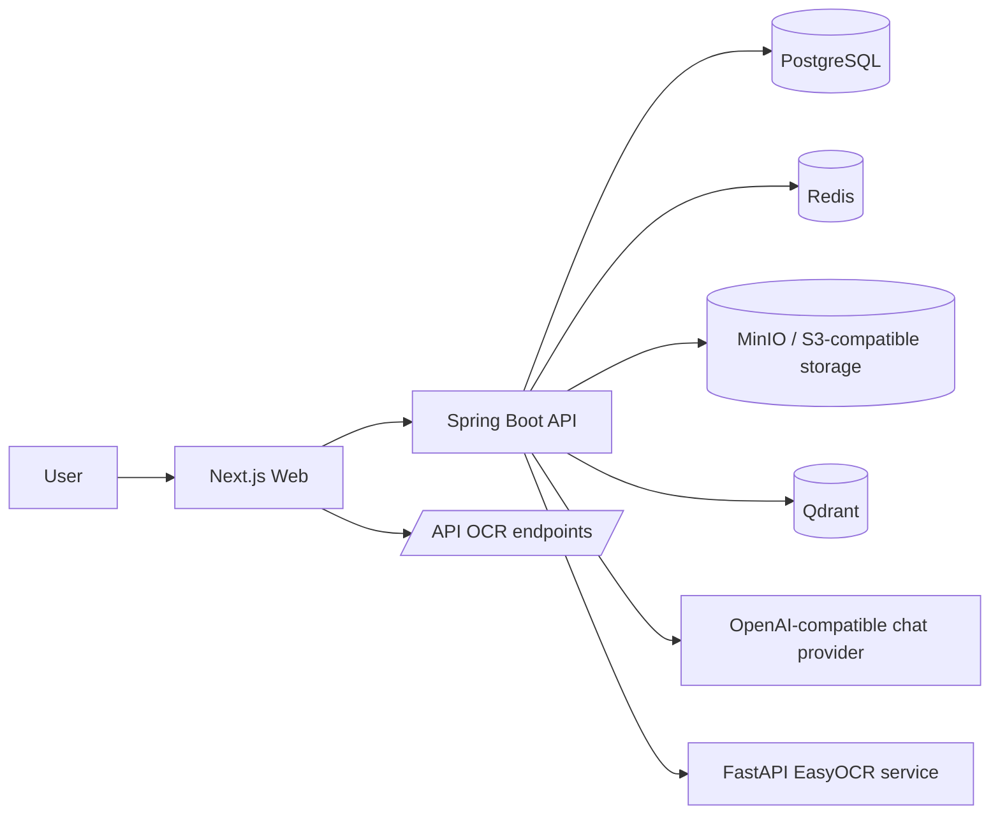

# HealthLens Architecture

**Last updated:** 2026-05-20

## Executive Summary

HealthLens is a monorepo composed of a Next.js web app, a Spring Boot API, a FastAPI OCR microservice, and a shared TypeScript contracts package. The architecture is service-oriented at the repository level and layered inside the API.

## Architectural Parts

### Web App

- Uses Next.js App Router under `apps/web/src/app`.
- Uses Axios API client with JWT bearer header injection and refresh retry behavior.
- Uses HttpOnly cookie support through `withCredentials`.
- Uses Zustand for auth state and TanStack Query for server-state dependencies.
- Pulls shared route constants from `@healthlens/shared/constants`.

### API

- Uses Spring Boot 4 and Java 21.
- Controllers expose REST endpoints under `/api/v1` plus OCR proxy routes under `/api/ocr`.
- Services own domain behavior for auth, profiles, health records, reference data, OCR, storage, email, AI, and sharing.
- Repositories use Spring Data JPA.
- Flyway migrations define the relational schema.
- Security uses JWT, Spring Security, rate limiters, account status cache, and special public routes for auth/dev/cancel flows.

### OCR Service

- FastAPI service with `GET /health` and `POST /ocr`.
- Lazily initializes EasyOCR with Vietnamese and English languages.
- Accepts image URLs, validates scheme/content type/size/dimensions, and returns extracted text, confidence, detected language, processing time, and block count.

### Shared Package

- Centralizes frontend-consumed constants and Zod schemas.
- `packages/shared/constants/api.ts` is the frontend single source of truth for route paths.
- Backend keeps a mirrored route registry in `ApiRoutes.java`; these two files must stay synchronized.

## Async And Event Delivery

HealthLens uses a hybrid async model. Redis Streams are the standard for durable cross-boundary work such as OCR processing and user-facing email events, but they are not a universal bus for every side effect. Synchronous service calls remain appropriate for command validation, domain state transitions, and command audit writes. DB-claimed jobs remain appropriate when a table row owns scheduling and claim state, such as follow-up reminders.

The canonical decision record is [event-driven-architecture.md](./event-driven-architecture.md). Backend refactors that touch `events.*`, `ocr.*`, `ai.*`, email delivery, reminders, audit, notifications, or analytics should follow that document.

## Data Architecture

- PostgreSQL is the primary relational store.
- Flyway migrations `V001` through `V027` define users, auth tokens, consent logs, deletion requests, profiles, health records, reference data, invitations, sharing, admin TOTP, approval workflows, and audit logs.
- Redis is used for cache, OCR stream delivery, and email stream delivery.
- Qdrant is configured as a vector store for explanation retrieval.
- MinIO is used locally for S3-compatible object storage; staging/production use managed S3-compatible storage.

## Security Architecture

- JWT access tokens are attached by the web client unless the route is public cancellation.
- Refresh-token flow retries eligible `401` responses and clears auth state on refresh failure.
- Admin authentication has separate `/api/v1/admin/auth` routes and TOTP setup/verify flows.
- Consent behavior is enforced through API-side consent annotations/aspects and user consent endpoints.
- Data deletion uses a public email token cancel endpoint outside `/users/me`.

## Integration Points

| From | To | Integration |
| --- | --- | --- |
| Web | API | REST over Axios using `NEXT_PUBLIC_API_BASE_URL` |
| API | PostgreSQL | JPA/Flyway |
| API | Redis | Cache and event stream configuration |
| API | MinIO/S3 | Presigned upload and file access |
| API | OCR service | HTTP call to `OCR_SERVICE_URL` |
| API | OpenAI-compatible chat provider | Spring AI OpenAI client configuration |
| API | Qdrant | Spring AI vector store |
| API | SMTP/Mailhog | Email verification, deletion, invitation templates |

## Deployment Architecture

Local development uses Docker Compose. Staging docs reference Vercel for web, Render for API/OCR, Neon for PostgreSQL, Upstash for Redis, Cloudflare R2 for storage, and managed Qdrant.
