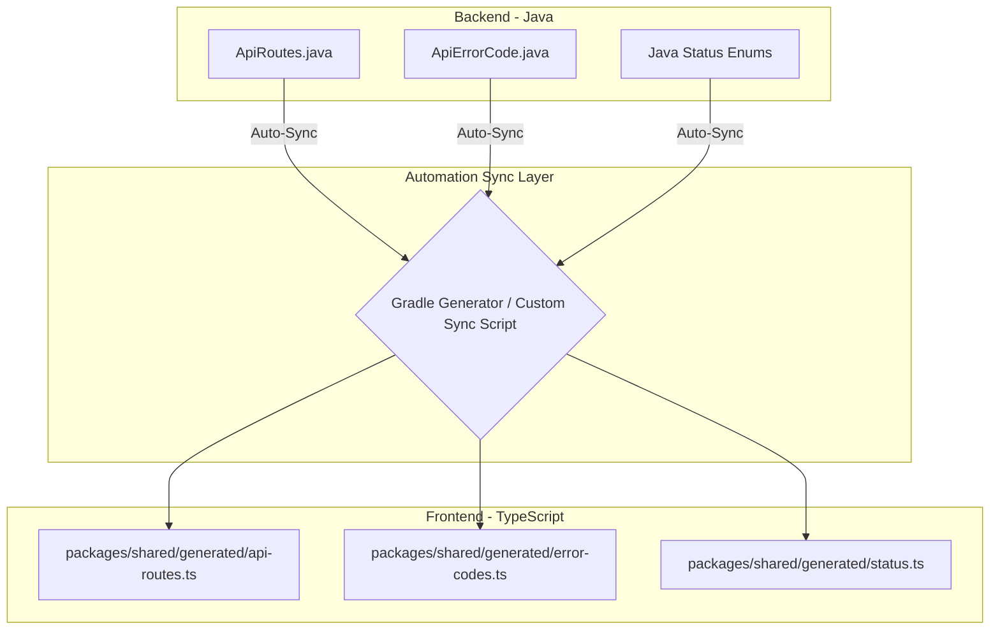

# 🚀 Kế hoạch cải tiến: Scripts, SQL Migrations & Tự động hóa đồng bộ Constants

Dưới đây là phân tích chi tiết và đề xuất giải pháp cho các thắc mắc của bạn, bao gồm cách cấu trúc, các thư viện/công cụ tự động hóa, cùng lộ trình thực hiện cụ thể.

---

## 1. Tối ưu hóa & Quy hoạch Scripts

### 1.1 Centralize Automation Scripts (Kịch bản A)
Hiện tại, các script tự động hóa nằm phân tán (`docker/scripts/`, `infisical/scripts/`, `apps/web/scripts/`). Chúng ta sẽ quy hoạch toàn bộ về một thư mục `/scripts` ở root của monorepo.

#### Thư mục đề xuất:
```text
health-lens/
├── scripts/
│   ├── docker-up.sh           (← docker/scripts/up.sh)
│   ├── docker-down.sh         (← docker/scripts/down.sh)
│   ├── docker-logs.sh         (← docker/scripts/logs.sh)
│   ├── docker-cleanup.sh      (← docker/scripts/cleanup.sh)
│   ├── infisical.sh           (← infisical/scripts/infisical.sh)
│   ├── smoke-sitemap.mjs      (← apps/web/scripts/smoke-sitemap-urls.mjs)
│   ├── mobile-reset.js        (← apps/mobile/scripts/reset-project.js)
│   ├── bootstrap.sh           (🔥 New: Setup môi trường ban đầu cho máy dev mới)
│   └── _common.sh             (🔥 New: Shared functions: màu sắc, kiểm tra Docker, OS)
```

#### Giải pháp xử lý đường dẫn tương đối (Relative Paths):
Khi chuyển script ra ngoài root, các script Docker/Infisical sẽ bị lỗi nếu gọi đường dẫn tương đối cũ.
- **Giải pháp:** Sử dụng `PROJECT_ROOT="$(cd "$(dirname "${BASH_SOURCE[0]}")/.." && pwd)"` làm mốc chuẩn ở đầu mỗi script để mọi đường dẫn tới Docker compose, `.env`, hay Gradle build luôn được phân giải chính xác tuyệt đối, bất kể script được chạy từ đâu.

---

### 1.2 Nén & Thu gọn các file SQL Migrations (Squashing Migrations)
Hiện tại dự án có **43 file migration SQL**. Khi deploy lên môi trường Staging/Production hoặc chạy test, Flyway phải thực thi 43 file này tuần tự, gây chậm thời gian startup và khó quản lý lịch sử DB.

#### Giải pháp: Squashing / Baselines Flyway
Chúng ta sẽ "nén" từ `V001` đến `V043` thành một file baseline duy nhất.

#### Quy trình thực hiện an toàn:
1. **Tạo Baseline Schema SQL:**
   Dùng công cụ `pg_dump` để dump toàn bộ schema (chỉ cấu trúc, không lấy data rác) của cơ sở dữ liệu hiện tại sau khi đã migrate đến `V043`:
   ```bash
   pg_dump -h localhost -U postgres -d healthlens --schema-only > baseline.sql
   ```
2. **Thay thế file Migration cũ:**
   - Xóa toàn bộ file từ `V001` đến `V043` trong `src/main/resources/db/migration/`.
   - Tạo một file duy nhất: `V001__baseline_schema.sql` và paste nội dung của `baseline.sql` vào.
   - Các migration mới sau này sẽ bắt đầu từ `V002`.
3. **Xử lý môi trường Production/Staging đã chạy cũ (Không được chạy lại V001):**
   Để tránh việc Flyway cố gắng chạy lại file `V001` trên DB thật đã có bảng (gây lỗi trùng bảng), ta dùng tính năng **Flyway Baseline**:
   - Khi deploy bản mới, chạy lệnh Flyway command line hoặc cấu hình trong Spring Boot:
     ```properties
     spring.flyway.baseline-on-migrate=true
     spring.flyway.baseline-version=1
     ```
   - Flyway sẽ tự động hiểu DB hiện tại đã ở level `V001` và bỏ qua không chạy file `V001__baseline_schema.sql` nữa, chỉ chạy tiếp các file sau đó.

---

### 1.3 Đề xuất thêm Script hỗ trợ Setup/Deployment
Để quá trình onboarding dev mới hoặc deploy lên VPS/Cloud mượt mà hơn, chúng ta cần bổ sung các script sau vào `/scripts`:
*   `scripts/bootstrap.sh`: Tự động kiểm tra các dependency cần thiết (Docker, Node, Java, pnpm, Infisical), clone file `.env.example` thành `.env`, pull secrets nếu có Infisical, cài đặt pnpm dependencies toàn monorepo và build shared package. Dev mới chỉ cần chạy đúng 1 lệnh này là code được luôn.
*   `scripts/check-health.sh`: Gọi thử Actuator health check `/actuator/health` của API và các service vệ tinh để kiểm tra xem hệ thống đã sẵn sàng nhận traffic chưa sau khi deploy.

---

## 2. Giải pháp đồng bộ hóa Constants tự động (Java ↔ TypeScript)

Đúng như bạn nghĩ, **có các thư viện rất mạnh** giúp xử lý việc này tự động để tránh việc code frontend và backend bị lệch pha (drift).

### 2.1 Các giải pháp công nghệ đề xuất

#### Giải pháp 1: TypeScript Generator Gradle Plugin (Khuyên dùng cho Constants/Enums nội bộ)
Sử dụng plugin `cz.habarta.typescript-generator:typescript-generator-gradle-plugin` tích hợp trực tiếp vào Gradle của `apps/api`.
*   **Cách hoạt động:** Khi bạn chạy `./gradlew build` hoặc một task gradle cụ thể, plugin này sẽ quét các Java Class, Enum, Constant chỉ định (như `ApiRoutes`, `ApiErrorCode`, `UserStatus`) và **tự động generate ra file `.d.ts` hoặc `.ts`** đặt vào thư mục `packages/shared/constants/` hoặc `apps/web/src/types/`.
*   **Ví dụ cấu hình Gradle:**
    ```kotlin
    configure<cz.habarta.typescript.generator.gradle.GenerateTask> {
        jsonLibrary = cz.habarta.typescript.generator.JsonLibrary.jackson2
        classes = listOf(
            "com.healthlens.api.constants.ApiRoutes",
            "com.healthlens.api.exception.ApiErrorCode",
            "com.healthlens.api.constants.SecurityConstants"
        )
        outputFileType = cz.habarta.typescript.generator.TypeScriptFileType.declarationFile
        outputFile = file("../../packages/shared/types/generated.d.ts")
    }
    ```

#### Giải pháp 2: OpenAPI Generator (Khuyên dùng cho API Routes & DTOs)
Dự án của bạn đã cài sẵn `springdoc-openapi-starter-webmvc-ui:2.8.8` (Swagger). Đây là một điểm cộng cực lớn!
*   **Cách hoạt động:** 
    1. Khi API chạy, Swagger sinh ra một file JSON mô tả toàn bộ API (`v3/api-docs`).
    2. Chúng ta dùng công cụ `@openapitools/openapi-generator-cli` chạy ở frontend.
    3. Công cụ này sẽ đọc file JSON đó và **generate ra toàn bộ code fetch API, API routes, và TypeScript Interfaces của DTOs** cho frontend. Frontend chỉ việc import dùng, không cần viết hàm `fetch` hay định nghĩa route thủ công nữa.

#### Giải pháp 3: Custom Node/Python Compiler Script (Giải pháp nhanh, kiểm soát cao)
Một script custom ngắn đặt trong `/scripts/sync-constants.js`. Script này sẽ đọc trực tiếp file `ApiRoutes.java` hoặc `ApiErrorCode.java` bằng regex, phân tích cú pháp các dòng `public static final String` và export ra file `.ts` tương ứng.
*   *Ưu điểm:* Cực kỳ nhẹ, không phụ thuộc vào plugin build nặng của Gradle, chạy tức thì qua lệnh Node.

---

### 2.2 Bàn luận về việc tổ chức lại Constants
Khi áp dụng tự động hóa, cấu trúc constants sẽ được tổ chức lại như sau để tối ưu hóa kiến trúc:



*   **Lợi ích:** Frontend hoàn toàn không tự viết tay các constants liên quan đến API hay Error Codes nữa. Mọi thay đổi của backend khi build sẽ ngay lập tức đồng bộ lên frontend, giảm thiểu 100% lỗi lệch route hay lệch mã lỗi.

---

## 3. Rà soát Source Code toàn diện (Cấu trúc, Logic & Tài liệu)

Qua việc kiểm tra sâu vào codebase, tôi phát hiện một số điểm chưa hợp lý về logic và cấu trúc cần cải thiện:

### 3.1 Vấn đề Logic & Security
*   **SSRF Protection (Remote Fetching):** OCR service lấy ảnh/tài liệu y tế qua URL. Nếu không giới hạn IP, kẻ tấn công có thể chèn URL trỏ tới internal network (ví dụ: `http://192.168.1.1/admin`) khiến server gọi và lộ dữ liệu nhạy cảm (Server-Side Request Forgery). Cần có một proxy/validator kiểm tra IP remote trước khi fetch.
*   **Email DLQ Security:** Email Consumer khi đẩy thư lỗi vào Dead Letter Queue (DLQ) để debug đang lưu kèm cả payload thô chứa các nhạy cảm như token đổi mật khẩu, link kích hoạt tài khoản. Cần redact (ẩn) các nhạy cảm này trước khi lưu vào DB/Log.

### 3.2 Vấn đề Cấu trúc Code
*   **Monorepo Symlink:** Sự tồn tại của thư mục ma `apps/web/apps/web` chỉ chứa node_modules rỗng cho thấy config resolution của monorepo hoặc file symlink có vấn đề trong quá trình deploy/install. Cần cleanup và tối ưu hóa file `pnpm-workspace.yaml`.
*   **Thư mục AI & Seed Data lộn xộn:** Thư mục `src/main/resources/ai/` vừa chứa prompts vừa chứa file dữ liệu seed JSON lớn. Nên quy hoạch prompts sang `/prompts` riêng và seed data sang `/seed` riêng.

### 3.3 Tài liệu (Docs)
*   Hiện tại hệ thống tài liệu rất tốt (18 file markdown), tuy nhiên chúng đang nằm phẳng (flat) tại thư mục `docs/`. Khi dự án phát triển thêm, ta nên phân nhóm chúng thành các thư mục con: `docs/architecture/`, `docs/guides/`, `docs/operations/` để dễ tìm kiếm.

---

## Lộ trình đề xuất triển khai

### Phase 1: Quy hoạch Scripts & Nén SQL (An toàn, tác động nhanh)
1. Gom toàn bộ script tự động hóa về thư mục `/scripts` ở root monorepo.
2. Viết file `_common.sh` để tái sử dụng mã nguồn dùng chung cho các script.
3. Tiến hành dump database, nén 43 file migration cũ thành `V001__baseline_schema.sql` và cấu hình Flyway baseline cho môi trường dev/staging.

### Phase 2: Thiết lập Tự động đồng bộ Constants (Giải phóng dev khỏi việc gõ tay)
1. Cài đặt plugin generate TypeScript hoặc viết script Node tự động sync `ApiRoutes.java` sang `shared/constants/api.ts`.
2. Chuẩn hóa error code format để frontend map trực tiếp sang mã lỗi tiếng Việt thống nhất.

### Phase 3: Refactor God Components & Logic Security (Tối ưu chuyên sâu)
1. Tách file page Next.js `review/[recordId]/page.tsx` từ 2,400 dòng thành các component nhỏ.
2. Tách service backend `HealthRecordService` khổng lồ thành Query/Command riêng biệt.
3. Harden logic bảo mật cho OCR fetch URL và DLQ payload logging.

Bạn thấy phương án gom script và phương pháp đồng bộ constants tự động này đã đúng hướng bạn mong muốn chưa? Chúng ta có thể bắt tay vào thực hiện Phase 1 ngay!
